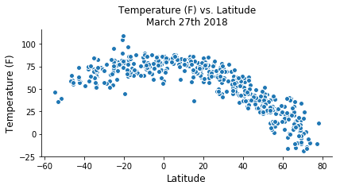
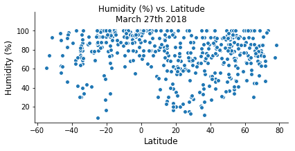
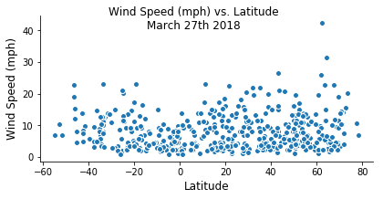
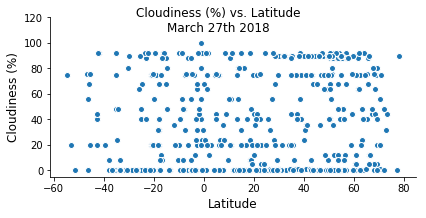
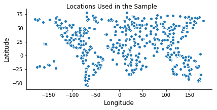

# About

Weather data was obtained for the cities nearest to random locations sampled around the World. Current weather conditions were used (as of March 27th 2018).

# Observations
 - Current temperature shows reverse dependency to the distance to the equator. Southern hemisphere shows on average higher temperatures than the Northern hemisphere
 - Lower humidity is observed only in the cities situated remotely from the equator and the poles.
 - Wind speed is on average lower in the cities situated closer to the equator
 - Cloudiness does not present a dependency on Latitude alone. 


```python
# Dependencies
import openweathermapy.core as owm
import pandas as pd
import matplotlib.pyplot as plt
import seaborn as sns
from config import api_key
import random as rnd
import requests
import json
from citipy import citipy
```


```python
url = "http://api.openweathermap.org/data/2.5/weather?"
cities_df=pd.DataFrame(columns=['Lat','Lon','Temp','Humidity', 'Wind', 'Cloudiness'])

while cities_df['Lat'].count()<500:
    lat=rnd.randint(-90, 90)
    lon=rnd.randint(-180, 180)
    city = citipy.nearest_city(lat, lon)
    city_country=city.city_name+","+city.country_code
    if(city_country not in cities_df.index):
        query_url = url + "appid=" + api_key + "&units=imperial&q=" + city_country
        print("Retreiving data for #"+str(cities_df['Lat'].count()+1)+" "+city_country+": "+query_url)
        weather_response = requests.get(query_url)
        weather_json = weather_response.json()
        try:
            cities_df.at[city_country]=[weather_json['coord']['lat'], weather_json['coord']['lon'], weather_json['main']['temp'], weather_json['main']['humidity'], weather_json['wind']['speed'], weather_json['clouds']['all']]  
        except:
            print("No data found for the city")
                                        
```

    Retreiving data for #1 marsassoum,sn: http://api.openweathermap.org/data/2.5/weather?appid=8aa7e9efa0ad8afcf9de20a76feaf5ef&units=imperial&q=marsassoum,sn
    Retreiving data for #2 inhambane,mz: http://api.openweathermap.org/data/2.5/weather?appid=8aa7e9efa0ad8afcf9de20a76feaf5ef&units=imperial&q=inhambane,mz
    Retreiving data for #3 vaini,to: http://api.openweathermap.org/data/2.5/weather?appid=8aa7e9efa0ad8afcf9de20a76feaf5ef&units=imperial&q=vaini,to
    Retreiving data for #4 tuktoyaktuk,ca: http://api.openweathermap.org/data/2.5/weather?appid=8aa7e9efa0ad8afcf9de20a76feaf5ef&units=imperial&q=tuktoyaktuk,ca
    Retreiving data for #5 mitu,co: http://api.openweathermap.org/data/2.5/weather?appid=8aa7e9efa0ad8afcf9de20a76feaf5ef&units=imperial&q=mitu,co
    Retreiving data for #6 vaitupu,wf: http://api.openweathermap.org/data/2.5/weather?appid=8aa7e9efa0ad8afcf9de20a76feaf5ef&units=imperial&q=vaitupu,wf
    No data found for the city
    Retreiving data for #6 albany,au: http://api.openweathermap.org/data/2.5/weather?appid=8aa7e9efa0ad8afcf9de20a76feaf5ef&units=imperial&q=albany,au
    Retreiving data for #7 atuona,pf: http://api.openweathermap.org/data/2.5/weather?appid=8aa7e9efa0ad8afcf9de20a76feaf5ef&units=imperial&q=atuona,pf
    Retreiving data for #8 egvekinot,ru: http://api.openweathermap.org/data/2.5/weather?appid=8aa7e9efa0ad8afcf9de20a76feaf5ef&units=imperial&q=egvekinot,ru
    Retreiving data for #9 keita,ne: http://api.openweathermap.org/data/2.5/weather?appid=8aa7e9efa0ad8afcf9de20a76feaf5ef&units=imperial&q=keita,ne
    Retreiving data for #10 cape town,za: http://api.openweathermap.org/data/2.5/weather?appid=8aa7e9efa0ad8afcf9de20a76feaf5ef&units=imperial&q=cape town,za
    Retreiving data for #11 zyryanka,ru: http://api.openweathermap.org/data/2.5/weather?appid=8aa7e9efa0ad8afcf9de20a76feaf5ef&units=imperial&q=zyryanka,ru
    Retreiving data for #12 isangel,vu: http://api.openweathermap.org/data/2.5/weather?appid=8aa7e9efa0ad8afcf9de20a76feaf5ef&units=imperial&q=isangel,vu
    Retreiving data for #13 laguna,br: http://api.openweathermap.org/data/2.5/weather?appid=8aa7e9efa0ad8afcf9de20a76feaf5ef&units=imperial&q=laguna,br
    No data found for the city
    Retreiving data for #13 waynesboro,us: http://api.openweathermap.org/data/2.5/weather?appid=8aa7e9efa0ad8afcf9de20a76feaf5ef&units=imperial&q=waynesboro,us
    Retreiving data for #14 hofn,is: http://api.openweathermap.org/data/2.5/weather?appid=8aa7e9efa0ad8afcf9de20a76feaf5ef&units=imperial&q=hofn,is
    Retreiving data for #15 east london,za: http://api.openweathermap.org/data/2.5/weather?appid=8aa7e9efa0ad8afcf9de20a76feaf5ef&units=imperial&q=east london,za
    Retreiving data for #16 faanui,pf: http://api.openweathermap.org/data/2.5/weather?appid=8aa7e9efa0ad8afcf9de20a76feaf5ef&units=imperial&q=faanui,pf
    Retreiving data for #17 mataura,pf: http://api.openweathermap.org/data/2.5/weather?appid=8aa7e9efa0ad8afcf9de20a76feaf5ef&units=imperial&q=mataura,pf
    No data found for the city
    Retreiving data for #17 danilovka,ru: http://api.openweathermap.org/data/2.5/weather?appid=8aa7e9efa0ad8afcf9de20a76feaf5ef&units=imperial&q=danilovka,ru
    Retreiving data for #18 northam,au: http://api.openweathermap.org/data/2.5/weather?appid=8aa7e9efa0ad8afcf9de20a76feaf5ef&units=imperial&q=northam,au
    Retreiving data for #19 mataura,pf: http://api.openweathermap.org/data/2.5/weather?appid=8aa7e9efa0ad8afcf9de20a76feaf5ef&units=imperial&q=mataura,pf
    No data found for the city
    Retreiving data for #19 ancud,cl: http://api.openweathermap.org/data/2.5/weather?appid=8aa7e9efa0ad8afcf9de20a76feaf5ef&units=imperial&q=ancud,cl
    Retreiving data for #20 ushuaia,ar: http://api.openweathermap.org/data/2.5/weather?appid=8aa7e9efa0ad8afcf9de20a76feaf5ef&units=imperial&q=ushuaia,ar
    Retreiving data for #21 preobrazheniye,ru: http://api.openweathermap.org/data/2.5/weather?appid=8aa7e9efa0ad8afcf9de20a76feaf5ef&units=imperial&q=preobrazheniye,ru
    Retreiving data for #22 marawi,sd: http://api.openweathermap.org/data/2.5/weather?appid=8aa7e9efa0ad8afcf9de20a76feaf5ef&units=imperial&q=marawi,sd
    Retreiving data for #23 rikitea,pf: http://api.openweathermap.org/data/2.5/weather?appid=8aa7e9efa0ad8afcf9de20a76feaf5ef&units=imperial&q=rikitea,pf
    Retreiving data for #24 port alfred,za: http://api.openweathermap.org/data/2.5/weather?appid=8aa7e9efa0ad8afcf9de20a76feaf5ef&units=imperial&q=port alfred,za
    Retreiving data for #25 karaul,ru: http://api.openweathermap.org/data/2.5/weather?appid=8aa7e9efa0ad8afcf9de20a76feaf5ef&units=imperial&q=karaul,ru
    No data found for the city
    Retreiving data for #25 kapaa,us: http://api.openweathermap.org/data/2.5/weather?appid=8aa7e9efa0ad8afcf9de20a76feaf5ef&units=imperial&q=kapaa,us
    Retreiving data for #26 mys shmidta,ru: http://api.openweathermap.org/data/2.5/weather?appid=8aa7e9efa0ad8afcf9de20a76feaf5ef&units=imperial&q=mys shmidta,ru
    No data found for the city
    Retreiving data for #26 kitob,uz: http://api.openweathermap.org/data/2.5/weather?appid=8aa7e9efa0ad8afcf9de20a76feaf5ef&units=imperial&q=kitob,uz
    Retreiving data for #27 rio gallegos,ar: http://api.openweathermap.org/data/2.5/weather?appid=8aa7e9efa0ad8afcf9de20a76feaf5ef&units=imperial&q=rio gallegos,ar
    Retreiving data for #28 kodiak,us: http://api.openweathermap.org/data/2.5/weather?appid=8aa7e9efa0ad8afcf9de20a76feaf5ef&units=imperial&q=kodiak,us
    Retreiving data for #29 olinda,br: http://api.openweathermap.org/data/2.5/weather?appid=8aa7e9efa0ad8afcf9de20a76feaf5ef&units=imperial&q=olinda,br
    Retreiving data for #30 pevek,ru: http://api.openweathermap.org/data/2.5/weather?appid=8aa7e9efa0ad8afcf9de20a76feaf5ef&units=imperial&q=pevek,ru
    Retreiving data for #31 vaitupu,wf: http://api.openweathermap.org/data/2.5/weather?appid=8aa7e9efa0ad8afcf9de20a76feaf5ef&units=imperial&q=vaitupu,wf
    No data found for the city
    Retreiving data for #31 namibe,ao: http://api.openweathermap.org/data/2.5/weather?appid=8aa7e9efa0ad8afcf9de20a76feaf5ef&units=imperial&q=namibe,ao
    Retreiving data for #32 pisco,pe: http://api.openweathermap.org/data/2.5/weather?appid=8aa7e9efa0ad8afcf9de20a76feaf5ef&units=imperial&q=pisco,pe
    Retreiving data for #33 dikson,ru: http://api.openweathermap.org/data/2.5/weather?appid=8aa7e9efa0ad8afcf9de20a76feaf5ef&units=imperial&q=dikson,ru
    Retreiving data for #34 maceio,br: http://api.openweathermap.org/data/2.5/weather?appid=8aa7e9efa0ad8afcf9de20a76feaf5ef&units=imperial&q=maceio,br
    Retreiving data for #35 tsihombe,mg: http://api.openweathermap.org/data/2.5/weather?appid=8aa7e9efa0ad8afcf9de20a76feaf5ef&units=imperial&q=tsihombe,mg
    No data found for the city
    Retreiving data for #35 taltal,cl: http://api.openweathermap.org/data/2.5/weather?appid=8aa7e9efa0ad8afcf9de20a76feaf5ef&units=imperial&q=taltal,cl
    Retreiving data for #36 mar del plata,ar: http://api.openweathermap.org/data/2.5/weather?appid=8aa7e9efa0ad8afcf9de20a76feaf5ef&units=imperial&q=mar del plata,ar
    Retreiving data for #37 savelugu,gh: http://api.openweathermap.org/data/2.5/weather?appid=8aa7e9efa0ad8afcf9de20a76feaf5ef&units=imperial&q=savelugu,gh
    Retreiving data for #38 zhangjiakou,cn: http://api.openweathermap.org/data/2.5/weather?appid=8aa7e9efa0ad8afcf9de20a76feaf5ef&units=imperial&q=zhangjiakou,cn
    Retreiving data for #39 kapuskasing,ca: http://api.openweathermap.org/data/2.5/weather?appid=8aa7e9efa0ad8afcf9de20a76feaf5ef&units=imperial&q=kapuskasing,ca
    Retreiving data for #40 butaritari,ki: http://api.openweathermap.org/data/2.5/weather?appid=8aa7e9efa0ad8afcf9de20a76feaf5ef&units=imperial&q=butaritari,ki
    Retreiving data for #41 saint anthony,ca: http://api.openweathermap.org/data/2.5/weather?appid=8aa7e9efa0ad8afcf9de20a76feaf5ef&units=imperial&q=saint anthony,ca
    No data found for the city
    Retreiving data for #41 jamestown,sh: http://api.openweathermap.org/data/2.5/weather?appid=8aa7e9efa0ad8afcf9de20a76feaf5ef&units=imperial&q=jamestown,sh
    Retreiving data for #42 gurgan,az: http://api.openweathermap.org/data/2.5/weather?appid=8aa7e9efa0ad8afcf9de20a76feaf5ef&units=imperial&q=gurgan,az
    No data found for the city
    Retreiving data for #42 nikolskoye,ru: http://api.openweathermap.org/data/2.5/weather?appid=8aa7e9efa0ad8afcf9de20a76feaf5ef&units=imperial&q=nikolskoye,ru
    Retreiving data for #43 xining,cn: http://api.openweathermap.org/data/2.5/weather?appid=8aa7e9efa0ad8afcf9de20a76feaf5ef&units=imperial&q=xining,cn
    Retreiving data for #44 luderitz,na: http://api.openweathermap.org/data/2.5/weather?appid=8aa7e9efa0ad8afcf9de20a76feaf5ef&units=imperial&q=luderitz,na
    Retreiving data for #45 taolanaro,mg: http://api.openweathermap.org/data/2.5/weather?appid=8aa7e9efa0ad8afcf9de20a76feaf5ef&units=imperial&q=taolanaro,mg
    No data found for the city
    Retreiving data for #45 castro,cl: http://api.openweathermap.org/data/2.5/weather?appid=8aa7e9efa0ad8afcf9de20a76feaf5ef&units=imperial&q=castro,cl
    Retreiving data for #46 tuatapere,nz: http://api.openweathermap.org/data/2.5/weather?appid=8aa7e9efa0ad8afcf9de20a76feaf5ef&units=imperial&q=tuatapere,nz
    Retreiving data for #47 ribeira grande,pt: http://api.openweathermap.org/data/2.5/weather?appid=8aa7e9efa0ad8afcf9de20a76feaf5ef&units=imperial&q=ribeira grande,pt
    Retreiving data for #48 mayskiy,ru: http://api.openweathermap.org/data/2.5/weather?appid=8aa7e9efa0ad8afcf9de20a76feaf5ef&units=imperial&q=mayskiy,ru
    Retreiving data for #49 wladyslawowo,pl: http://api.openweathermap.org/data/2.5/weather?appid=8aa7e9efa0ad8afcf9de20a76feaf5ef&units=imperial&q=wladyslawowo,pl
    Retreiving data for #50 hayesville,us: http://api.openweathermap.org/data/2.5/weather?appid=8aa7e9efa0ad8afcf9de20a76feaf5ef&units=imperial&q=hayesville,us
    Retreiving data for #51 freeport,us: http://api.openweathermap.org/data/2.5/weather?appid=8aa7e9efa0ad8afcf9de20a76feaf5ef&units=imperial&q=freeport,us
    Retreiving data for #52 haines junction,ca: http://api.openweathermap.org/data/2.5/weather?appid=8aa7e9efa0ad8afcf9de20a76feaf5ef&units=imperial&q=haines junction,ca
    Retreiving data for #53 puerto escondido,mx: http://api.openweathermap.org/data/2.5/weather?appid=8aa7e9efa0ad8afcf9de20a76feaf5ef&units=imperial&q=puerto escondido,mx
    Retreiving data for #54 hermanus,za: http://api.openweathermap.org/data/2.5/weather?appid=8aa7e9efa0ad8afcf9de20a76feaf5ef&units=imperial&q=hermanus,za
    Retreiving data for #55 busselton,au: http://api.openweathermap.org/data/2.5/weather?appid=8aa7e9efa0ad8afcf9de20a76feaf5ef&units=imperial&q=busselton,au
    Retreiving data for #56 yatou,cn: http://api.openweathermap.org/data/2.5/weather?appid=8aa7e9efa0ad8afcf9de20a76feaf5ef&units=imperial&q=yatou,cn
    Retreiving data for #57 ayan,ru: http://api.openweathermap.org/data/2.5/weather?appid=8aa7e9efa0ad8afcf9de20a76feaf5ef&units=imperial&q=ayan,ru
    No data found for the city
    Retreiving data for #57 port-gentil,ga: http://api.openweathermap.org/data/2.5/weather?appid=8aa7e9efa0ad8afcf9de20a76feaf5ef&units=imperial&q=port-gentil,ga
    Retreiving data for #58 katsuura,jp: http://api.openweathermap.org/data/2.5/weather?appid=8aa7e9efa0ad8afcf9de20a76feaf5ef&units=imperial&q=katsuura,jp
    Retreiving data for #59 amderma,ru: http://api.openweathermap.org/data/2.5/weather?appid=8aa7e9efa0ad8afcf9de20a76feaf5ef&units=imperial&q=amderma,ru
    No data found for the city
    Retreiving data for #59 port moresby,pg: http://api.openweathermap.org/data/2.5/weather?appid=8aa7e9efa0ad8afcf9de20a76feaf5ef&units=imperial&q=port moresby,pg
    Retreiving data for #60 barrow,us: http://api.openweathermap.org/data/2.5/weather?appid=8aa7e9efa0ad8afcf9de20a76feaf5ef&units=imperial&q=barrow,us
    Retreiving data for #61 vila do maio,cv: http://api.openweathermap.org/data/2.5/weather?appid=8aa7e9efa0ad8afcf9de20a76feaf5ef&units=imperial&q=vila do maio,cv
    Retreiving data for #62 bluff,nz: http://api.openweathermap.org/data/2.5/weather?appid=8aa7e9efa0ad8afcf9de20a76feaf5ef&units=imperial&q=bluff,nz
    Retreiving data for #63 sorong,id: http://api.openweathermap.org/data/2.5/weather?appid=8aa7e9efa0ad8afcf9de20a76feaf5ef&units=imperial&q=sorong,id
    Retreiving data for #64 coahuayana,mx: http://api.openweathermap.org/data/2.5/weather?appid=8aa7e9efa0ad8afcf9de20a76feaf5ef&units=imperial&q=coahuayana,mx
    Retreiving data for #65 samusu,ws: http://api.openweathermap.org/data/2.5/weather?appid=8aa7e9efa0ad8afcf9de20a76feaf5ef&units=imperial&q=samusu,ws
    No data found for the city
    Retreiving data for #65 kirakira,sb: http://api.openweathermap.org/data/2.5/weather?appid=8aa7e9efa0ad8afcf9de20a76feaf5ef&units=imperial&q=kirakira,sb
    Retreiving data for #66 bathsheba,bb: http://api.openweathermap.org/data/2.5/weather?appid=8aa7e9efa0ad8afcf9de20a76feaf5ef&units=imperial&q=bathsheba,bb
    Retreiving data for #67 bayji,iq: http://api.openweathermap.org/data/2.5/weather?appid=8aa7e9efa0ad8afcf9de20a76feaf5ef&units=imperial&q=bayji,iq
    Retreiving data for #68 ossora,ru: http://api.openweathermap.org/data/2.5/weather?appid=8aa7e9efa0ad8afcf9de20a76feaf5ef&units=imperial&q=ossora,ru
    Retreiving data for #69 cherskiy,ru: http://api.openweathermap.org/data/2.5/weather?appid=8aa7e9efa0ad8afcf9de20a76feaf5ef&units=imperial&q=cherskiy,ru
    Retreiving data for #70 mahebourg,mu: http://api.openweathermap.org/data/2.5/weather?appid=8aa7e9efa0ad8afcf9de20a76feaf5ef&units=imperial&q=mahebourg,mu
    Retreiving data for #71 padang,id: http://api.openweathermap.org/data/2.5/weather?appid=8aa7e9efa0ad8afcf9de20a76feaf5ef&units=imperial&q=padang,id
    Retreiving data for #72 san quintin,mx: http://api.openweathermap.org/data/2.5/weather?appid=8aa7e9efa0ad8afcf9de20a76feaf5ef&units=imperial&q=san quintin,mx
    No data found for the city
    Retreiving data for #72 el cobre,cu: http://api.openweathermap.org/data/2.5/weather?appid=8aa7e9efa0ad8afcf9de20a76feaf5ef&units=imperial&q=el cobre,cu
    Retreiving data for #73 sitka,us: http://api.openweathermap.org/data/2.5/weather?appid=8aa7e9efa0ad8afcf9de20a76feaf5ef&units=imperial&q=sitka,us
    Retreiving data for #74 codrington,ag: http://api.openweathermap.org/data/2.5/weather?appid=8aa7e9efa0ad8afcf9de20a76feaf5ef&units=imperial&q=codrington,ag
    No data found for the city
    Retreiving data for #74 veraval,in: http://api.openweathermap.org/data/2.5/weather?appid=8aa7e9efa0ad8afcf9de20a76feaf5ef&units=imperial&q=veraval,in
    Retreiving data for #75 maua,ke: http://api.openweathermap.org/data/2.5/weather?appid=8aa7e9efa0ad8afcf9de20a76feaf5ef&units=imperial&q=maua,ke
    Retreiving data for #76 yellowknife,ca: http://api.openweathermap.org/data/2.5/weather?appid=8aa7e9efa0ad8afcf9de20a76feaf5ef&units=imperial&q=yellowknife,ca
    Retreiving data for #77 novikovo,ru: http://api.openweathermap.org/data/2.5/weather?appid=8aa7e9efa0ad8afcf9de20a76feaf5ef&units=imperial&q=novikovo,ru
    Retreiving data for #78 palembang,id: http://api.openweathermap.org/data/2.5/weather?appid=8aa7e9efa0ad8afcf9de20a76feaf5ef&units=imperial&q=palembang,id
    Retreiving data for #79 tasiilaq,gl: http://api.openweathermap.org/data/2.5/weather?appid=8aa7e9efa0ad8afcf9de20a76feaf5ef&units=imperial&q=tasiilaq,gl
    Retreiving data for #80 upernavik,gl: http://api.openweathermap.org/data/2.5/weather?appid=8aa7e9efa0ad8afcf9de20a76feaf5ef&units=imperial&q=upernavik,gl
    Retreiving data for #81 avarua,ck: http://api.openweathermap.org/data/2.5/weather?appid=8aa7e9efa0ad8afcf9de20a76feaf5ef&units=imperial&q=avarua,ck
    Retreiving data for #82 talnakh,ru: http://api.openweathermap.org/data/2.5/weather?appid=8aa7e9efa0ad8afcf9de20a76feaf5ef&units=imperial&q=talnakh,ru
    Retreiving data for #83 new norfolk,au: http://api.openweathermap.org/data/2.5/weather?appid=8aa7e9efa0ad8afcf9de20a76feaf5ef&units=imperial&q=new norfolk,au
    Retreiving data for #84 beidao,cn: http://api.openweathermap.org/data/2.5/weather?appid=8aa7e9efa0ad8afcf9de20a76feaf5ef&units=imperial&q=beidao,cn
    Retreiving data for #85 kavieng,pg: http://api.openweathermap.org/data/2.5/weather?appid=8aa7e9efa0ad8afcf9de20a76feaf5ef&units=imperial&q=kavieng,pg
    Retreiving data for #86 the pas,ca: http://api.openweathermap.org/data/2.5/weather?appid=8aa7e9efa0ad8afcf9de20a76feaf5ef&units=imperial&q=the pas,ca
    Retreiving data for #87 porbandar,in: http://api.openweathermap.org/data/2.5/weather?appid=8aa7e9efa0ad8afcf9de20a76feaf5ef&units=imperial&q=porbandar,in
    Retreiving data for #88 hambantota,lk: http://api.openweathermap.org/data/2.5/weather?appid=8aa7e9efa0ad8afcf9de20a76feaf5ef&units=imperial&q=hambantota,lk
    Retreiving data for #89 mataura,pf: http://api.openweathermap.org/data/2.5/weather?appid=8aa7e9efa0ad8afcf9de20a76feaf5ef&units=imperial&q=mataura,pf
    No data found for the city
    Retreiving data for #89 puerto ayora,ec: http://api.openweathermap.org/data/2.5/weather?appid=8aa7e9efa0ad8afcf9de20a76feaf5ef&units=imperial&q=puerto ayora,ec
    Retreiving data for #90 lakes entrance,au: http://api.openweathermap.org/data/2.5/weather?appid=8aa7e9efa0ad8afcf9de20a76feaf5ef&units=imperial&q=lakes entrance,au
    Retreiving data for #91 mataura,pf: http://api.openweathermap.org/data/2.5/weather?appid=8aa7e9efa0ad8afcf9de20a76feaf5ef&units=imperial&q=mataura,pf
    No data found for the city
    Retreiving data for #91 lebu,cl: http://api.openweathermap.org/data/2.5/weather?appid=8aa7e9efa0ad8afcf9de20a76feaf5ef&units=imperial&q=lebu,cl
    Retreiving data for #92 mataura,pf: http://api.openweathermap.org/data/2.5/weather?appid=8aa7e9efa0ad8afcf9de20a76feaf5ef&units=imperial&q=mataura,pf
    No data found for the city
    Retreiving data for #92 paracatu,br: http://api.openweathermap.org/data/2.5/weather?appid=8aa7e9efa0ad8afcf9de20a76feaf5ef&units=imperial&q=paracatu,br
    Retreiving data for #93 taolanaro,mg: http://api.openweathermap.org/data/2.5/weather?appid=8aa7e9efa0ad8afcf9de20a76feaf5ef&units=imperial&q=taolanaro,mg
    No data found for the city
    Retreiving data for #93 yulara,au: http://api.openweathermap.org/data/2.5/weather?appid=8aa7e9efa0ad8afcf9de20a76feaf5ef&units=imperial&q=yulara,au
    Retreiving data for #94 vestmannaeyjar,is: http://api.openweathermap.org/data/2.5/weather?appid=8aa7e9efa0ad8afcf9de20a76feaf5ef&units=imperial&q=vestmannaeyjar,is
    Retreiving data for #95 bethel,us: http://api.openweathermap.org/data/2.5/weather?appid=8aa7e9efa0ad8afcf9de20a76feaf5ef&units=imperial&q=bethel,us
    Retreiving data for #96 belushya guba,ru: http://api.openweathermap.org/data/2.5/weather?appid=8aa7e9efa0ad8afcf9de20a76feaf5ef&units=imperial&q=belushya guba,ru
    No data found for the city
    Retreiving data for #96 lolua,tv: http://api.openweathermap.org/data/2.5/weather?appid=8aa7e9efa0ad8afcf9de20a76feaf5ef&units=imperial&q=lolua,tv
    No data found for the city
    Retreiving data for #96 panguipulli,cl: http://api.openweathermap.org/data/2.5/weather?appid=8aa7e9efa0ad8afcf9de20a76feaf5ef&units=imperial&q=panguipulli,cl
    Retreiving data for #97 flinders,au: http://api.openweathermap.org/data/2.5/weather?appid=8aa7e9efa0ad8afcf9de20a76feaf5ef&units=imperial&q=flinders,au
    Retreiving data for #98 chlum u trebone,cz: http://api.openweathermap.org/data/2.5/weather?appid=8aa7e9efa0ad8afcf9de20a76feaf5ef&units=imperial&q=chlum u trebone,cz
    Retreiving data for #99 mataura,pf: http://api.openweathermap.org/data/2.5/weather?appid=8aa7e9efa0ad8afcf9de20a76feaf5ef&units=imperial&q=mataura,pf
    No data found for the city
    Retreiving data for #99 zalaszentgrot,hu: http://api.openweathermap.org/data/2.5/weather?appid=8aa7e9efa0ad8afcf9de20a76feaf5ef&units=imperial&q=zalaszentgrot,hu
    Retreiving data for #100 mataura,pf: http://api.openweathermap.org/data/2.5/weather?appid=8aa7e9efa0ad8afcf9de20a76feaf5ef&units=imperial&q=mataura,pf
    No data found for the city
    Retreiving data for #100 qaanaaq,gl: http://api.openweathermap.org/data/2.5/weather?appid=8aa7e9efa0ad8afcf9de20a76feaf5ef&units=imperial&q=qaanaaq,gl
    Retreiving data for #101 bilma,ne: http://api.openweathermap.org/data/2.5/weather?appid=8aa7e9efa0ad8afcf9de20a76feaf5ef&units=imperial&q=bilma,ne
    Retreiving data for #102 broome,au: http://api.openweathermap.org/data/2.5/weather?appid=8aa7e9efa0ad8afcf9de20a76feaf5ef&units=imperial&q=broome,au
    Retreiving data for #103 amderma,ru: http://api.openweathermap.org/data/2.5/weather?appid=8aa7e9efa0ad8afcf9de20a76feaf5ef&units=imperial&q=amderma,ru
    No data found for the city
    Retreiving data for #103 kiunga,pg: http://api.openweathermap.org/data/2.5/weather?appid=8aa7e9efa0ad8afcf9de20a76feaf5ef&units=imperial&q=kiunga,pg
    Retreiving data for #104 geraldton,au: http://api.openweathermap.org/data/2.5/weather?appid=8aa7e9efa0ad8afcf9de20a76feaf5ef&units=imperial&q=geraldton,au
    Retreiving data for #105 khani,ru: http://api.openweathermap.org/data/2.5/weather?appid=8aa7e9efa0ad8afcf9de20a76feaf5ef&units=imperial&q=khani,ru
    No data found for the city
    Retreiving data for #105 attawapiskat,ca: http://api.openweathermap.org/data/2.5/weather?appid=8aa7e9efa0ad8afcf9de20a76feaf5ef&units=imperial&q=attawapiskat,ca
    No data found for the city
    Retreiving data for #105 port blair,in: http://api.openweathermap.org/data/2.5/weather?appid=8aa7e9efa0ad8afcf9de20a76feaf5ef&units=imperial&q=port blair,in
    Retreiving data for #106 belushya guba,ru: http://api.openweathermap.org/data/2.5/weather?appid=8aa7e9efa0ad8afcf9de20a76feaf5ef&units=imperial&q=belushya guba,ru
    No data found for the city
    Retreiving data for #106 flin flon,ca: http://api.openweathermap.org/data/2.5/weather?appid=8aa7e9efa0ad8afcf9de20a76feaf5ef&units=imperial&q=flin flon,ca
    Retreiving data for #107 punta arenas,cl: http://api.openweathermap.org/data/2.5/weather?appid=8aa7e9efa0ad8afcf9de20a76feaf5ef&units=imperial&q=punta arenas,cl
    Retreiving data for #108 starobaltachevo,ru: http://api.openweathermap.org/data/2.5/weather?appid=8aa7e9efa0ad8afcf9de20a76feaf5ef&units=imperial&q=starobaltachevo,ru
    Retreiving data for #109 ormara,pk: http://api.openweathermap.org/data/2.5/weather?appid=8aa7e9efa0ad8afcf9de20a76feaf5ef&units=imperial&q=ormara,pk
    Retreiving data for #110 taolanaro,mg: http://api.openweathermap.org/data/2.5/weather?appid=8aa7e9efa0ad8afcf9de20a76feaf5ef&units=imperial&q=taolanaro,mg
    No data found for the city
    Retreiving data for #110 correntina,br: http://api.openweathermap.org/data/2.5/weather?appid=8aa7e9efa0ad8afcf9de20a76feaf5ef&units=imperial&q=correntina,br
    Retreiving data for #111 saint-augustin,ca: http://api.openweathermap.org/data/2.5/weather?appid=8aa7e9efa0ad8afcf9de20a76feaf5ef&units=imperial&q=saint-augustin,ca
    Retreiving data for #112 hithadhoo,mv: http://api.openweathermap.org/data/2.5/weather?appid=8aa7e9efa0ad8afcf9de20a76feaf5ef&units=imperial&q=hithadhoo,mv
    Retreiving data for #113 graneros,cl: http://api.openweathermap.org/data/2.5/weather?appid=8aa7e9efa0ad8afcf9de20a76feaf5ef&units=imperial&q=graneros,cl
    Retreiving data for #114 taolanaro,mg: http://api.openweathermap.org/data/2.5/weather?appid=8aa7e9efa0ad8afcf9de20a76feaf5ef&units=imperial&q=taolanaro,mg
    No data found for the city
    Retreiving data for #114 ampanihy,mg: http://api.openweathermap.org/data/2.5/weather?appid=8aa7e9efa0ad8afcf9de20a76feaf5ef&units=imperial&q=ampanihy,mg
    Retreiving data for #115 sao filipe,cv: http://api.openweathermap.org/data/2.5/weather?appid=8aa7e9efa0ad8afcf9de20a76feaf5ef&units=imperial&q=sao filipe,cv
    Retreiving data for #116 chuy,uy: http://api.openweathermap.org/data/2.5/weather?appid=8aa7e9efa0ad8afcf9de20a76feaf5ef&units=imperial&q=chuy,uy
    Retreiving data for #117 goderich,sl: http://api.openweathermap.org/data/2.5/weather?appid=8aa7e9efa0ad8afcf9de20a76feaf5ef&units=imperial&q=goderich,sl
    No data found for the city
    Retreiving data for #117 lagoa,pt: http://api.openweathermap.org/data/2.5/weather?appid=8aa7e9efa0ad8afcf9de20a76feaf5ef&units=imperial&q=lagoa,pt
    Retreiving data for #118 airai,pw: http://api.openweathermap.org/data/2.5/weather?appid=8aa7e9efa0ad8afcf9de20a76feaf5ef&units=imperial&q=airai,pw
    No data found for the city
    Retreiving data for #118 baykit,ru: http://api.openweathermap.org/data/2.5/weather?appid=8aa7e9efa0ad8afcf9de20a76feaf5ef&units=imperial&q=baykit,ru
    Retreiving data for #119 santa helena de goias,br: http://api.openweathermap.org/data/2.5/weather?appid=8aa7e9efa0ad8afcf9de20a76feaf5ef&units=imperial&q=santa helena de goias,br
    Retreiving data for #120 katangli,ru: http://api.openweathermap.org/data/2.5/weather?appid=8aa7e9efa0ad8afcf9de20a76feaf5ef&units=imperial&q=katangli,ru
    Retreiving data for #121 hobart,au: http://api.openweathermap.org/data/2.5/weather?appid=8aa7e9efa0ad8afcf9de20a76feaf5ef&units=imperial&q=hobart,au
    Retreiving data for #122 taolanaro,mg: http://api.openweathermap.org/data/2.5/weather?appid=8aa7e9efa0ad8afcf9de20a76feaf5ef&units=imperial&q=taolanaro,mg
    No data found for the city
    Retreiving data for #122 ahipara,nz: http://api.openweathermap.org/data/2.5/weather?appid=8aa7e9efa0ad8afcf9de20a76feaf5ef&units=imperial&q=ahipara,nz
    Retreiving data for #123 tiksi,ru: http://api.openweathermap.org/data/2.5/weather?appid=8aa7e9efa0ad8afcf9de20a76feaf5ef&units=imperial&q=tiksi,ru
    Retreiving data for #124 hilo,us: http://api.openweathermap.org/data/2.5/weather?appid=8aa7e9efa0ad8afcf9de20a76feaf5ef&units=imperial&q=hilo,us
    Retreiving data for #125 vaitupu,wf: http://api.openweathermap.org/data/2.5/weather?appid=8aa7e9efa0ad8afcf9de20a76feaf5ef&units=imperial&q=vaitupu,wf
    No data found for the city
    Retreiving data for #125 klaebu,no: http://api.openweathermap.org/data/2.5/weather?appid=8aa7e9efa0ad8afcf9de20a76feaf5ef&units=imperial&q=klaebu,no
    Retreiving data for #126 nome,us: http://api.openweathermap.org/data/2.5/weather?appid=8aa7e9efa0ad8afcf9de20a76feaf5ef&units=imperial&q=nome,us
    Retreiving data for #127 alofi,nu: http://api.openweathermap.org/data/2.5/weather?appid=8aa7e9efa0ad8afcf9de20a76feaf5ef&units=imperial&q=alofi,nu
    Retreiving data for #128 manta,ec: http://api.openweathermap.org/data/2.5/weather?appid=8aa7e9efa0ad8afcf9de20a76feaf5ef&units=imperial&q=manta,ec
    Retreiving data for #129 saint-philippe,re: http://api.openweathermap.org/data/2.5/weather?appid=8aa7e9efa0ad8afcf9de20a76feaf5ef&units=imperial&q=saint-philippe,re
    Retreiving data for #130 maniitsoq,gl: http://api.openweathermap.org/data/2.5/weather?appid=8aa7e9efa0ad8afcf9de20a76feaf5ef&units=imperial&q=maniitsoq,gl
    Retreiving data for #131 illoqqortoormiut,gl: http://api.openweathermap.org/data/2.5/weather?appid=8aa7e9efa0ad8afcf9de20a76feaf5ef&units=imperial&q=illoqqortoormiut,gl
    No data found for the city
    Retreiving data for #131 barentsburg,sj: http://api.openweathermap.org/data/2.5/weather?appid=8aa7e9efa0ad8afcf9de20a76feaf5ef&units=imperial&q=barentsburg,sj
    No data found for the city
    Retreiving data for #131 sur,om: http://api.openweathermap.org/data/2.5/weather?appid=8aa7e9efa0ad8afcf9de20a76feaf5ef&units=imperial&q=sur,om
    Retreiving data for #132 kamenka,ru: http://api.openweathermap.org/data/2.5/weather?appid=8aa7e9efa0ad8afcf9de20a76feaf5ef&units=imperial&q=kamenka,ru
    Retreiving data for #133 mataura,pf: http://api.openweathermap.org/data/2.5/weather?appid=8aa7e9efa0ad8afcf9de20a76feaf5ef&units=imperial&q=mataura,pf
    No data found for the city
    Retreiving data for #133 belaya gora,ru: http://api.openweathermap.org/data/2.5/weather?appid=8aa7e9efa0ad8afcf9de20a76feaf5ef&units=imperial&q=belaya gora,ru
    Retreiving data for #134 asau,tv: http://api.openweathermap.org/data/2.5/weather?appid=8aa7e9efa0ad8afcf9de20a76feaf5ef&units=imperial&q=asau,tv
    No data found for the city
    Retreiving data for #134 vangaindrano,mg: http://api.openweathermap.org/data/2.5/weather?appid=8aa7e9efa0ad8afcf9de20a76feaf5ef&units=imperial&q=vangaindrano,mg
    Retreiving data for #135 illoqqortoormiut,gl: http://api.openweathermap.org/data/2.5/weather?appid=8aa7e9efa0ad8afcf9de20a76feaf5ef&units=imperial&q=illoqqortoormiut,gl
    No data found for the city
    Retreiving data for #135 cayenne,gf: http://api.openweathermap.org/data/2.5/weather?appid=8aa7e9efa0ad8afcf9de20a76feaf5ef&units=imperial&q=cayenne,gf
    Retreiving data for #136 ishigaki,jp: http://api.openweathermap.org/data/2.5/weather?appid=8aa7e9efa0ad8afcf9de20a76feaf5ef&units=imperial&q=ishigaki,jp
    Retreiving data for #137 bengkulu,id: http://api.openweathermap.org/data/2.5/weather?appid=8aa7e9efa0ad8afcf9de20a76feaf5ef&units=imperial&q=bengkulu,id
    No data found for the city
    Retreiving data for #137 arraial do cabo,br: http://api.openweathermap.org/data/2.5/weather?appid=8aa7e9efa0ad8afcf9de20a76feaf5ef&units=imperial&q=arraial do cabo,br
    Retreiving data for #138 arlit,ne: http://api.openweathermap.org/data/2.5/weather?appid=8aa7e9efa0ad8afcf9de20a76feaf5ef&units=imperial&q=arlit,ne
    Retreiving data for #139 lolua,tv: http://api.openweathermap.org/data/2.5/weather?appid=8aa7e9efa0ad8afcf9de20a76feaf5ef&units=imperial&q=lolua,tv
    No data found for the city
    Retreiving data for #139 awjilah,ly: http://api.openweathermap.org/data/2.5/weather?appid=8aa7e9efa0ad8afcf9de20a76feaf5ef&units=imperial&q=awjilah,ly
    Retreiving data for #140 port elizabeth,za: http://api.openweathermap.org/data/2.5/weather?appid=8aa7e9efa0ad8afcf9de20a76feaf5ef&units=imperial&q=port elizabeth,za
    Retreiving data for #141 nizhneyansk,ru: http://api.openweathermap.org/data/2.5/weather?appid=8aa7e9efa0ad8afcf9de20a76feaf5ef&units=imperial&q=nizhneyansk,ru
    No data found for the city
    Retreiving data for #141 khatanga,ru: http://api.openweathermap.org/data/2.5/weather?appid=8aa7e9efa0ad8afcf9de20a76feaf5ef&units=imperial&q=khatanga,ru
    Retreiving data for #142 carnarvon,au: http://api.openweathermap.org/data/2.5/weather?appid=8aa7e9efa0ad8afcf9de20a76feaf5ef&units=imperial&q=carnarvon,au
    Retreiving data for #143 do gonbadan,ir: http://api.openweathermap.org/data/2.5/weather?appid=8aa7e9efa0ad8afcf9de20a76feaf5ef&units=imperial&q=do gonbadan,ir
    Retreiving data for #144 villa del rosario,ve: http://api.openweathermap.org/data/2.5/weather?appid=8aa7e9efa0ad8afcf9de20a76feaf5ef&units=imperial&q=villa del rosario,ve
    Retreiving data for #145 caravelas,br: http://api.openweathermap.org/data/2.5/weather?appid=8aa7e9efa0ad8afcf9de20a76feaf5ef&units=imperial&q=caravelas,br
    Retreiving data for #146 yumen,cn: http://api.openweathermap.org/data/2.5/weather?appid=8aa7e9efa0ad8afcf9de20a76feaf5ef&units=imperial&q=yumen,cn
    Retreiving data for #147 rundu,na: http://api.openweathermap.org/data/2.5/weather?appid=8aa7e9efa0ad8afcf9de20a76feaf5ef&units=imperial&q=rundu,na
    Retreiving data for #148 hami,cn: http://api.openweathermap.org/data/2.5/weather?appid=8aa7e9efa0ad8afcf9de20a76feaf5ef&units=imperial&q=hami,cn
    Retreiving data for #149 wanning,cn: http://api.openweathermap.org/data/2.5/weather?appid=8aa7e9efa0ad8afcf9de20a76feaf5ef&units=imperial&q=wanning,cn
    Retreiving data for #150 hasaki,jp: http://api.openweathermap.org/data/2.5/weather?appid=8aa7e9efa0ad8afcf9de20a76feaf5ef&units=imperial&q=hasaki,jp
    Retreiving data for #151 tazovskiy,ru: http://api.openweathermap.org/data/2.5/weather?appid=8aa7e9efa0ad8afcf9de20a76feaf5ef&units=imperial&q=tazovskiy,ru
    Retreiving data for #152 puerto madryn,ar: http://api.openweathermap.org/data/2.5/weather?appid=8aa7e9efa0ad8afcf9de20a76feaf5ef&units=imperial&q=puerto madryn,ar
    Retreiving data for #153 illoqqortoormiut,gl: http://api.openweathermap.org/data/2.5/weather?appid=8aa7e9efa0ad8afcf9de20a76feaf5ef&units=imperial&q=illoqqortoormiut,gl
    No data found for the city
    Retreiving data for #153 bairiki,ki: http://api.openweathermap.org/data/2.5/weather?appid=8aa7e9efa0ad8afcf9de20a76feaf5ef&units=imperial&q=bairiki,ki
    No data found for the city
    Retreiving data for #153 khuldabad,in: http://api.openweathermap.org/data/2.5/weather?appid=8aa7e9efa0ad8afcf9de20a76feaf5ef&units=imperial&q=khuldabad,in
    Retreiving data for #154 pokhara,np: http://api.openweathermap.org/data/2.5/weather?appid=8aa7e9efa0ad8afcf9de20a76feaf5ef&units=imperial&q=pokhara,np
    Retreiving data for #155 huarmey,pe: http://api.openweathermap.org/data/2.5/weather?appid=8aa7e9efa0ad8afcf9de20a76feaf5ef&units=imperial&q=huarmey,pe
    Retreiving data for #156 macau,br: http://api.openweathermap.org/data/2.5/weather?appid=8aa7e9efa0ad8afcf9de20a76feaf5ef&units=imperial&q=macau,br
    Retreiving data for #157 kruisfontein,za: http://api.openweathermap.org/data/2.5/weather?appid=8aa7e9efa0ad8afcf9de20a76feaf5ef&units=imperial&q=kruisfontein,za
    Retreiving data for #158 illoqqortoormiut,gl: http://api.openweathermap.org/data/2.5/weather?appid=8aa7e9efa0ad8afcf9de20a76feaf5ef&units=imperial&q=illoqqortoormiut,gl
    No data found for the city
    Retreiving data for #158 mataura,pf: http://api.openweathermap.org/data/2.5/weather?appid=8aa7e9efa0ad8afcf9de20a76feaf5ef&units=imperial&q=mataura,pf
    No data found for the city
    Retreiving data for #158 taolanaro,mg: http://api.openweathermap.org/data/2.5/weather?appid=8aa7e9efa0ad8afcf9de20a76feaf5ef&units=imperial&q=taolanaro,mg
    No data found for the city
    Retreiving data for #158 belgrade,us: http://api.openweathermap.org/data/2.5/weather?appid=8aa7e9efa0ad8afcf9de20a76feaf5ef&units=imperial&q=belgrade,us
    Retreiving data for #159 kuvshinovo,ru: http://api.openweathermap.org/data/2.5/weather?appid=8aa7e9efa0ad8afcf9de20a76feaf5ef&units=imperial&q=kuvshinovo,ru
    Retreiving data for #160 houston,ca: http://api.openweathermap.org/data/2.5/weather?appid=8aa7e9efa0ad8afcf9de20a76feaf5ef&units=imperial&q=houston,ca
    Retreiving data for #161 bay roberts,ca: http://api.openweathermap.org/data/2.5/weather?appid=8aa7e9efa0ad8afcf9de20a76feaf5ef&units=imperial&q=bay roberts,ca
    Retreiving data for #162 victoria,sc: http://api.openweathermap.org/data/2.5/weather?appid=8aa7e9efa0ad8afcf9de20a76feaf5ef&units=imperial&q=victoria,sc
    Retreiving data for #163 birin,dz: http://api.openweathermap.org/data/2.5/weather?appid=8aa7e9efa0ad8afcf9de20a76feaf5ef&units=imperial&q=birin,dz
    No data found for the city
    Retreiving data for #163 bolungarvik,is: http://api.openweathermap.org/data/2.5/weather?appid=8aa7e9efa0ad8afcf9de20a76feaf5ef&units=imperial&q=bolungarvik,is
    No data found for the city
    Retreiving data for #163 airai,pw: http://api.openweathermap.org/data/2.5/weather?appid=8aa7e9efa0ad8afcf9de20a76feaf5ef&units=imperial&q=airai,pw
    No data found for the city
    Retreiving data for #163 barentsburg,sj: http://api.openweathermap.org/data/2.5/weather?appid=8aa7e9efa0ad8afcf9de20a76feaf5ef&units=imperial&q=barentsburg,sj
    No data found for the city
    Retreiving data for #163 sri aman,my: http://api.openweathermap.org/data/2.5/weather?appid=8aa7e9efa0ad8afcf9de20a76feaf5ef&units=imperial&q=sri aman,my
    Retreiving data for #164 praia da vitoria,pt: http://api.openweathermap.org/data/2.5/weather?appid=8aa7e9efa0ad8afcf9de20a76feaf5ef&units=imperial&q=praia da vitoria,pt
    Retreiving data for #165 saleaula,ws: http://api.openweathermap.org/data/2.5/weather?appid=8aa7e9efa0ad8afcf9de20a76feaf5ef&units=imperial&q=saleaula,ws
    No data found for the city
    Retreiving data for #165 chapais,ca: http://api.openweathermap.org/data/2.5/weather?appid=8aa7e9efa0ad8afcf9de20a76feaf5ef&units=imperial&q=chapais,ca
    Retreiving data for #166 karratha,au: http://api.openweathermap.org/data/2.5/weather?appid=8aa7e9efa0ad8afcf9de20a76feaf5ef&units=imperial&q=karratha,au
    Retreiving data for #167 adrar,dz: http://api.openweathermap.org/data/2.5/weather?appid=8aa7e9efa0ad8afcf9de20a76feaf5ef&units=imperial&q=adrar,dz
    Retreiving data for #168 raga,sd: http://api.openweathermap.org/data/2.5/weather?appid=8aa7e9efa0ad8afcf9de20a76feaf5ef&units=imperial&q=raga,sd
    No data found for the city
    Retreiving data for #168 ibra,om: http://api.openweathermap.org/data/2.5/weather?appid=8aa7e9efa0ad8afcf9de20a76feaf5ef&units=imperial&q=ibra,om
    Retreiving data for #169 klyuchi,ru: http://api.openweathermap.org/data/2.5/weather?appid=8aa7e9efa0ad8afcf9de20a76feaf5ef&units=imperial&q=klyuchi,ru
    Retreiving data for #170 esso,ru: http://api.openweathermap.org/data/2.5/weather?appid=8aa7e9efa0ad8afcf9de20a76feaf5ef&units=imperial&q=esso,ru
    Retreiving data for #171 bilibino,ru: http://api.openweathermap.org/data/2.5/weather?appid=8aa7e9efa0ad8afcf9de20a76feaf5ef&units=imperial&q=bilibino,ru
    Retreiving data for #172 severo-kurilsk,ru: http://api.openweathermap.org/data/2.5/weather?appid=8aa7e9efa0ad8afcf9de20a76feaf5ef&units=imperial&q=severo-kurilsk,ru
    Retreiving data for #173 kazalinsk,kz: http://api.openweathermap.org/data/2.5/weather?appid=8aa7e9efa0ad8afcf9de20a76feaf5ef&units=imperial&q=kazalinsk,kz
    No data found for the city
    Retreiving data for #173 beloha,mg: http://api.openweathermap.org/data/2.5/weather?appid=8aa7e9efa0ad8afcf9de20a76feaf5ef&units=imperial&q=beloha,mg
    Retreiving data for #174 vinh,vn: http://api.openweathermap.org/data/2.5/weather?appid=8aa7e9efa0ad8afcf9de20a76feaf5ef&units=imperial&q=vinh,vn
    Retreiving data for #175 hervey bay,au: http://api.openweathermap.org/data/2.5/weather?appid=8aa7e9efa0ad8afcf9de20a76feaf5ef&units=imperial&q=hervey bay,au
    Retreiving data for #176 bredasdorp,za: http://api.openweathermap.org/data/2.5/weather?appid=8aa7e9efa0ad8afcf9de20a76feaf5ef&units=imperial&q=bredasdorp,za
    Retreiving data for #177 fort nelson,ca: http://api.openweathermap.org/data/2.5/weather?appid=8aa7e9efa0ad8afcf9de20a76feaf5ef&units=imperial&q=fort nelson,ca
    Retreiving data for #178 rengo,cl: http://api.openweathermap.org/data/2.5/weather?appid=8aa7e9efa0ad8afcf9de20a76feaf5ef&units=imperial&q=rengo,cl
    Retreiving data for #179 russell,nz: http://api.openweathermap.org/data/2.5/weather?appid=8aa7e9efa0ad8afcf9de20a76feaf5ef&units=imperial&q=russell,nz
    Retreiving data for #180 yomitan,jp: http://api.openweathermap.org/data/2.5/weather?appid=8aa7e9efa0ad8afcf9de20a76feaf5ef&units=imperial&q=yomitan,jp
    No data found for the city
    Retreiving data for #180 khonuu,ru: http://api.openweathermap.org/data/2.5/weather?appid=8aa7e9efa0ad8afcf9de20a76feaf5ef&units=imperial&q=khonuu,ru
    No data found for the city
    Retreiving data for #180 poplar bluff,us: http://api.openweathermap.org/data/2.5/weather?appid=8aa7e9efa0ad8afcf9de20a76feaf5ef&units=imperial&q=poplar bluff,us
    Retreiving data for #181 amderma,ru: http://api.openweathermap.org/data/2.5/weather?appid=8aa7e9efa0ad8afcf9de20a76feaf5ef&units=imperial&q=amderma,ru
    No data found for the city
    Retreiving data for #181 faya,td: http://api.openweathermap.org/data/2.5/weather?appid=8aa7e9efa0ad8afcf9de20a76feaf5ef&units=imperial&q=faya,td
    No data found for the city
    Retreiving data for #181 sabzevar,ir: http://api.openweathermap.org/data/2.5/weather?appid=8aa7e9efa0ad8afcf9de20a76feaf5ef&units=imperial&q=sabzevar,ir
    Retreiving data for #182 saint george,bm: http://api.openweathermap.org/data/2.5/weather?appid=8aa7e9efa0ad8afcf9de20a76feaf5ef&units=imperial&q=saint george,bm
    Retreiving data for #183 cabo san lucas,mx: http://api.openweathermap.org/data/2.5/weather?appid=8aa7e9efa0ad8afcf9de20a76feaf5ef&units=imperial&q=cabo san lucas,mx
    Retreiving data for #184 bar harbor,us: http://api.openweathermap.org/data/2.5/weather?appid=8aa7e9efa0ad8afcf9de20a76feaf5ef&units=imperial&q=bar harbor,us
    Retreiving data for #185 tunxi,cn: http://api.openweathermap.org/data/2.5/weather?appid=8aa7e9efa0ad8afcf9de20a76feaf5ef&units=imperial&q=tunxi,cn
    No data found for the city
    Retreiving data for #185 ardistan,ir: http://api.openweathermap.org/data/2.5/weather?appid=8aa7e9efa0ad8afcf9de20a76feaf5ef&units=imperial&q=ardistan,ir
    No data found for the city
    Retreiving data for #185 puerto baquerizo moreno,ec: http://api.openweathermap.org/data/2.5/weather?appid=8aa7e9efa0ad8afcf9de20a76feaf5ef&units=imperial&q=puerto baquerizo moreno,ec
    Retreiving data for #186 qaqortoq,gl: http://api.openweathermap.org/data/2.5/weather?appid=8aa7e9efa0ad8afcf9de20a76feaf5ef&units=imperial&q=qaqortoq,gl
    Retreiving data for #187 ilulissat,gl: http://api.openweathermap.org/data/2.5/weather?appid=8aa7e9efa0ad8afcf9de20a76feaf5ef&units=imperial&q=ilulissat,gl
    Retreiving data for #188 tucuma,br: http://api.openweathermap.org/data/2.5/weather?appid=8aa7e9efa0ad8afcf9de20a76feaf5ef&units=imperial&q=tucuma,br
    No data found for the city
    Retreiving data for #188 mecca,sa: http://api.openweathermap.org/data/2.5/weather?appid=8aa7e9efa0ad8afcf9de20a76feaf5ef&units=imperial&q=mecca,sa
    Retreiving data for #189 baiyin,cn: http://api.openweathermap.org/data/2.5/weather?appid=8aa7e9efa0ad8afcf9de20a76feaf5ef&units=imperial&q=baiyin,cn
    Retreiving data for #190 mataura,pf: http://api.openweathermap.org/data/2.5/weather?appid=8aa7e9efa0ad8afcf9de20a76feaf5ef&units=imperial&q=mataura,pf
    No data found for the city
    Retreiving data for #190 pacific grove,us: http://api.openweathermap.org/data/2.5/weather?appid=8aa7e9efa0ad8afcf9de20a76feaf5ef&units=imperial&q=pacific grove,us
    Retreiving data for #191 odessa,us: http://api.openweathermap.org/data/2.5/weather?appid=8aa7e9efa0ad8afcf9de20a76feaf5ef&units=imperial&q=odessa,us
    Retreiving data for #192 mitsamiouli,km: http://api.openweathermap.org/data/2.5/weather?appid=8aa7e9efa0ad8afcf9de20a76feaf5ef&units=imperial&q=mitsamiouli,km
    Retreiving data for #193 vostok,ru: http://api.openweathermap.org/data/2.5/weather?appid=8aa7e9efa0ad8afcf9de20a76feaf5ef&units=imperial&q=vostok,ru
    Retreiving data for #194 mount gambier,au: http://api.openweathermap.org/data/2.5/weather?appid=8aa7e9efa0ad8afcf9de20a76feaf5ef&units=imperial&q=mount gambier,au
    Retreiving data for #195 tsihombe,mg: http://api.openweathermap.org/data/2.5/weather?appid=8aa7e9efa0ad8afcf9de20a76feaf5ef&units=imperial&q=tsihombe,mg
    No data found for the city
    Retreiving data for #195 belushya guba,ru: http://api.openweathermap.org/data/2.5/weather?appid=8aa7e9efa0ad8afcf9de20a76feaf5ef&units=imperial&q=belushya guba,ru
    No data found for the city
    Retreiving data for #195 kabinda,cd: http://api.openweathermap.org/data/2.5/weather?appid=8aa7e9efa0ad8afcf9de20a76feaf5ef&units=imperial&q=kabinda,cd
    Retreiving data for #196 makakilo city,us: http://api.openweathermap.org/data/2.5/weather?appid=8aa7e9efa0ad8afcf9de20a76feaf5ef&units=imperial&q=makakilo city,us
    Retreiving data for #197 lavrentiya,ru: http://api.openweathermap.org/data/2.5/weather?appid=8aa7e9efa0ad8afcf9de20a76feaf5ef&units=imperial&q=lavrentiya,ru
    Retreiving data for #198 am timan,td: http://api.openweathermap.org/data/2.5/weather?appid=8aa7e9efa0ad8afcf9de20a76feaf5ef&units=imperial&q=am timan,td
    Retreiving data for #199 puerto colombia,co: http://api.openweathermap.org/data/2.5/weather?appid=8aa7e9efa0ad8afcf9de20a76feaf5ef&units=imperial&q=puerto colombia,co
    Retreiving data for #200 antofagasta,cl: http://api.openweathermap.org/data/2.5/weather?appid=8aa7e9efa0ad8afcf9de20a76feaf5ef&units=imperial&q=antofagasta,cl
    Retreiving data for #201 bur gabo,so: http://api.openweathermap.org/data/2.5/weather?appid=8aa7e9efa0ad8afcf9de20a76feaf5ef&units=imperial&q=bur gabo,so
    No data found for the city
    Retreiving data for #201 sao francisco,br: http://api.openweathermap.org/data/2.5/weather?appid=8aa7e9efa0ad8afcf9de20a76feaf5ef&units=imperial&q=sao francisco,br
    Retreiving data for #202 xuanhua,cn: http://api.openweathermap.org/data/2.5/weather?appid=8aa7e9efa0ad8afcf9de20a76feaf5ef&units=imperial&q=xuanhua,cn
    Retreiving data for #203 airai,pw: http://api.openweathermap.org/data/2.5/weather?appid=8aa7e9efa0ad8afcf9de20a76feaf5ef&units=imperial&q=airai,pw
    No data found for the city
    Retreiving data for #203 belushya guba,ru: http://api.openweathermap.org/data/2.5/weather?appid=8aa7e9efa0ad8afcf9de20a76feaf5ef&units=imperial&q=belushya guba,ru
    No data found for the city
    Retreiving data for #203 kizhinga,ru: http://api.openweathermap.org/data/2.5/weather?appid=8aa7e9efa0ad8afcf9de20a76feaf5ef&units=imperial&q=kizhinga,ru
    Retreiving data for #204 longyearbyen,sj: http://api.openweathermap.org/data/2.5/weather?appid=8aa7e9efa0ad8afcf9de20a76feaf5ef&units=imperial&q=longyearbyen,sj
    Retreiving data for #205 thompson,ca: http://api.openweathermap.org/data/2.5/weather?appid=8aa7e9efa0ad8afcf9de20a76feaf5ef&units=imperial&q=thompson,ca
    Retreiving data for #206 grindavik,is: http://api.openweathermap.org/data/2.5/weather?appid=8aa7e9efa0ad8afcf9de20a76feaf5ef&units=imperial&q=grindavik,is
    Retreiving data for #207 miranorte,br: http://api.openweathermap.org/data/2.5/weather?appid=8aa7e9efa0ad8afcf9de20a76feaf5ef&units=imperial&q=miranorte,br
    No data found for the city
    Retreiving data for #207 laguna,br: http://api.openweathermap.org/data/2.5/weather?appid=8aa7e9efa0ad8afcf9de20a76feaf5ef&units=imperial&q=laguna,br
    No data found for the city
    Retreiving data for #207 tessalit,ml: http://api.openweathermap.org/data/2.5/weather?appid=8aa7e9efa0ad8afcf9de20a76feaf5ef&units=imperial&q=tessalit,ml
    Retreiving data for #208 mandalgovi,mn: http://api.openweathermap.org/data/2.5/weather?appid=8aa7e9efa0ad8afcf9de20a76feaf5ef&units=imperial&q=mandalgovi,mn
    Retreiving data for #209 roblin,ca: http://api.openweathermap.org/data/2.5/weather?appid=8aa7e9efa0ad8afcf9de20a76feaf5ef&units=imperial&q=roblin,ca
    Retreiving data for #210 imeni poliny osipenko,ru: http://api.openweathermap.org/data/2.5/weather?appid=8aa7e9efa0ad8afcf9de20a76feaf5ef&units=imperial&q=imeni poliny osipenko,ru
    Retreiving data for #211 tsihombe,mg: http://api.openweathermap.org/data/2.5/weather?appid=8aa7e9efa0ad8afcf9de20a76feaf5ef&units=imperial&q=tsihombe,mg
    No data found for the city
    Retreiving data for #211 belushya guba,ru: http://api.openweathermap.org/data/2.5/weather?appid=8aa7e9efa0ad8afcf9de20a76feaf5ef&units=imperial&q=belushya guba,ru
    No data found for the city
    Retreiving data for #211 cockburn town,tc: http://api.openweathermap.org/data/2.5/weather?appid=8aa7e9efa0ad8afcf9de20a76feaf5ef&units=imperial&q=cockburn town,tc
    Retreiving data for #212 cuamba,mz: http://api.openweathermap.org/data/2.5/weather?appid=8aa7e9efa0ad8afcf9de20a76feaf5ef&units=imperial&q=cuamba,mz
    Retreiving data for #213 belushya guba,ru: http://api.openweathermap.org/data/2.5/weather?appid=8aa7e9efa0ad8afcf9de20a76feaf5ef&units=imperial&q=belushya guba,ru
    No data found for the city
    Retreiving data for #213 panama city,us: http://api.openweathermap.org/data/2.5/weather?appid=8aa7e9efa0ad8afcf9de20a76feaf5ef&units=imperial&q=panama city,us
    Retreiving data for #214 luorong,cn: http://api.openweathermap.org/data/2.5/weather?appid=8aa7e9efa0ad8afcf9de20a76feaf5ef&units=imperial&q=luorong,cn
    Retreiving data for #215 rupert,us: http://api.openweathermap.org/data/2.5/weather?appid=8aa7e9efa0ad8afcf9de20a76feaf5ef&units=imperial&q=rupert,us
    Retreiving data for #216 copiapo,cl: http://api.openweathermap.org/data/2.5/weather?appid=8aa7e9efa0ad8afcf9de20a76feaf5ef&units=imperial&q=copiapo,cl
    Retreiving data for #217 grand river south east,mu: http://api.openweathermap.org/data/2.5/weather?appid=8aa7e9efa0ad8afcf9de20a76feaf5ef&units=imperial&q=grand river south east,mu
    No data found for the city
    Retreiving data for #217 kota kinabalu,my: http://api.openweathermap.org/data/2.5/weather?appid=8aa7e9efa0ad8afcf9de20a76feaf5ef&units=imperial&q=kota kinabalu,my
    Retreiving data for #218 batsfjord,no: http://api.openweathermap.org/data/2.5/weather?appid=8aa7e9efa0ad8afcf9de20a76feaf5ef&units=imperial&q=batsfjord,no
    Retreiving data for #219 saleaula,ws: http://api.openweathermap.org/data/2.5/weather?appid=8aa7e9efa0ad8afcf9de20a76feaf5ef&units=imperial&q=saleaula,ws
    No data found for the city
    Retreiving data for #219 aleksandrovskiy zavod,ru: http://api.openweathermap.org/data/2.5/weather?appid=8aa7e9efa0ad8afcf9de20a76feaf5ef&units=imperial&q=aleksandrovskiy zavod,ru
    Retreiving data for #220 cumbernauld,gb: http://api.openweathermap.org/data/2.5/weather?appid=8aa7e9efa0ad8afcf9de20a76feaf5ef&units=imperial&q=cumbernauld,gb
    Retreiving data for #221 georgetown,sh: http://api.openweathermap.org/data/2.5/weather?appid=8aa7e9efa0ad8afcf9de20a76feaf5ef&units=imperial&q=georgetown,sh
    Retreiving data for #222 half moon bay,us: http://api.openweathermap.org/data/2.5/weather?appid=8aa7e9efa0ad8afcf9de20a76feaf5ef&units=imperial&q=half moon bay,us
    Retreiving data for #223 khonuu,ru: http://api.openweathermap.org/data/2.5/weather?appid=8aa7e9efa0ad8afcf9de20a76feaf5ef&units=imperial&q=khonuu,ru
    No data found for the city
    Retreiving data for #223 pecky,cz: http://api.openweathermap.org/data/2.5/weather?appid=8aa7e9efa0ad8afcf9de20a76feaf5ef&units=imperial&q=pecky,cz
    Retreiving data for #224 sayyan,ye: http://api.openweathermap.org/data/2.5/weather?appid=8aa7e9efa0ad8afcf9de20a76feaf5ef&units=imperial&q=sayyan,ye
    Retreiving data for #225 mataura,pf: http://api.openweathermap.org/data/2.5/weather?appid=8aa7e9efa0ad8afcf9de20a76feaf5ef&units=imperial&q=mataura,pf
    No data found for the city
    Retreiving data for #225 illoqqortoormiut,gl: http://api.openweathermap.org/data/2.5/weather?appid=8aa7e9efa0ad8afcf9de20a76feaf5ef&units=imperial&q=illoqqortoormiut,gl
    No data found for the city
    Retreiving data for #225 marcona,pe: http://api.openweathermap.org/data/2.5/weather?appid=8aa7e9efa0ad8afcf9de20a76feaf5ef&units=imperial&q=marcona,pe
    No data found for the city
    Retreiving data for #225 chokurdakh,ru: http://api.openweathermap.org/data/2.5/weather?appid=8aa7e9efa0ad8afcf9de20a76feaf5ef&units=imperial&q=chokurdakh,ru
    Retreiving data for #226 la tuque,ca: http://api.openweathermap.org/data/2.5/weather?appid=8aa7e9efa0ad8afcf9de20a76feaf5ef&units=imperial&q=la tuque,ca
    Retreiving data for #227 phan rang,vn: http://api.openweathermap.org/data/2.5/weather?appid=8aa7e9efa0ad8afcf9de20a76feaf5ef&units=imperial&q=phan rang,vn
    No data found for the city
    Retreiving data for #227 clyde river,ca: http://api.openweathermap.org/data/2.5/weather?appid=8aa7e9efa0ad8afcf9de20a76feaf5ef&units=imperial&q=clyde river,ca
    Retreiving data for #228 dingle,ie: http://api.openweathermap.org/data/2.5/weather?appid=8aa7e9efa0ad8afcf9de20a76feaf5ef&units=imperial&q=dingle,ie
    Retreiving data for #229 keningau,my: http://api.openweathermap.org/data/2.5/weather?appid=8aa7e9efa0ad8afcf9de20a76feaf5ef&units=imperial&q=keningau,my
    Retreiving data for #230 achit,ru: http://api.openweathermap.org/data/2.5/weather?appid=8aa7e9efa0ad8afcf9de20a76feaf5ef&units=imperial&q=achit,ru
    Retreiving data for #231 norman wells,ca: http://api.openweathermap.org/data/2.5/weather?appid=8aa7e9efa0ad8afcf9de20a76feaf5ef&units=imperial&q=norman wells,ca
    Retreiving data for #232 husavik,is: http://api.openweathermap.org/data/2.5/weather?appid=8aa7e9efa0ad8afcf9de20a76feaf5ef&units=imperial&q=husavik,is
    Retreiving data for #233 rongai,ke: http://api.openweathermap.org/data/2.5/weather?appid=8aa7e9efa0ad8afcf9de20a76feaf5ef&units=imperial&q=rongai,ke
    Retreiving data for #234 tubruq,ly: http://api.openweathermap.org/data/2.5/weather?appid=8aa7e9efa0ad8afcf9de20a76feaf5ef&units=imperial&q=tubruq,ly
    No data found for the city
    Retreiving data for #234 krasnozerskoye,ru: http://api.openweathermap.org/data/2.5/weather?appid=8aa7e9efa0ad8afcf9de20a76feaf5ef&units=imperial&q=krasnozerskoye,ru
    Retreiving data for #235 paita,pe: http://api.openweathermap.org/data/2.5/weather?appid=8aa7e9efa0ad8afcf9de20a76feaf5ef&units=imperial&q=paita,pe
    Retreiving data for #236 cam ranh,vn: http://api.openweathermap.org/data/2.5/weather?appid=8aa7e9efa0ad8afcf9de20a76feaf5ef&units=imperial&q=cam ranh,vn
    Retreiving data for #237 bur gabo,so: http://api.openweathermap.org/data/2.5/weather?appid=8aa7e9efa0ad8afcf9de20a76feaf5ef&units=imperial&q=bur gabo,so
    No data found for the city
    Retreiving data for #237 bakhmach,ua: http://api.openweathermap.org/data/2.5/weather?appid=8aa7e9efa0ad8afcf9de20a76feaf5ef&units=imperial&q=bakhmach,ua
    Retreiving data for #238 ternate,id: http://api.openweathermap.org/data/2.5/weather?appid=8aa7e9efa0ad8afcf9de20a76feaf5ef&units=imperial&q=ternate,id
    Retreiving data for #239 guerrero negro,mx: http://api.openweathermap.org/data/2.5/weather?appid=8aa7e9efa0ad8afcf9de20a76feaf5ef&units=imperial&q=guerrero negro,mx
    Retreiving data for #240 vila velha,br: http://api.openweathermap.org/data/2.5/weather?appid=8aa7e9efa0ad8afcf9de20a76feaf5ef&units=imperial&q=vila velha,br
    Retreiving data for #241 batabano,cu: http://api.openweathermap.org/data/2.5/weather?appid=8aa7e9efa0ad8afcf9de20a76feaf5ef&units=imperial&q=batabano,cu
    Retreiving data for #242 vallenar,cl: http://api.openweathermap.org/data/2.5/weather?appid=8aa7e9efa0ad8afcf9de20a76feaf5ef&units=imperial&q=vallenar,cl
    Retreiving data for #243 avera,pf: http://api.openweathermap.org/data/2.5/weather?appid=8aa7e9efa0ad8afcf9de20a76feaf5ef&units=imperial&q=avera,pf
    No data found for the city
    Retreiving data for #243 marsh harbour,bs: http://api.openweathermap.org/data/2.5/weather?appid=8aa7e9efa0ad8afcf9de20a76feaf5ef&units=imperial&q=marsh harbour,bs
    Retreiving data for #244 malindi,ke: http://api.openweathermap.org/data/2.5/weather?appid=8aa7e9efa0ad8afcf9de20a76feaf5ef&units=imperial&q=malindi,ke
    Retreiving data for #245 tsihombe,mg: http://api.openweathermap.org/data/2.5/weather?appid=8aa7e9efa0ad8afcf9de20a76feaf5ef&units=imperial&q=tsihombe,mg
    No data found for the city
    Retreiving data for #245 salalah,om: http://api.openweathermap.org/data/2.5/weather?appid=8aa7e9efa0ad8afcf9de20a76feaf5ef&units=imperial&q=salalah,om
    Retreiving data for #246 mataura,pf: http://api.openweathermap.org/data/2.5/weather?appid=8aa7e9efa0ad8afcf9de20a76feaf5ef&units=imperial&q=mataura,pf
    No data found for the city
    Retreiving data for #246 mys shmidta,ru: http://api.openweathermap.org/data/2.5/weather?appid=8aa7e9efa0ad8afcf9de20a76feaf5ef&units=imperial&q=mys shmidta,ru
    No data found for the city
    Retreiving data for #246 margate,za: http://api.openweathermap.org/data/2.5/weather?appid=8aa7e9efa0ad8afcf9de20a76feaf5ef&units=imperial&q=margate,za
    Retreiving data for #247 kaitangata,nz: http://api.openweathermap.org/data/2.5/weather?appid=8aa7e9efa0ad8afcf9de20a76feaf5ef&units=imperial&q=kaitangata,nz
    Retreiving data for #248 honiara,sb: http://api.openweathermap.org/data/2.5/weather?appid=8aa7e9efa0ad8afcf9de20a76feaf5ef&units=imperial&q=honiara,sb
    Retreiving data for #249 carballo,es: http://api.openweathermap.org/data/2.5/weather?appid=8aa7e9efa0ad8afcf9de20a76feaf5ef&units=imperial&q=carballo,es
    Retreiving data for #250 illoqqortoormiut,gl: http://api.openweathermap.org/data/2.5/weather?appid=8aa7e9efa0ad8afcf9de20a76feaf5ef&units=imperial&q=illoqqortoormiut,gl
    No data found for the city
    Retreiving data for #250 muros,es: http://api.openweathermap.org/data/2.5/weather?appid=8aa7e9efa0ad8afcf9de20a76feaf5ef&units=imperial&q=muros,es
    Retreiving data for #251 shenzhen,cn: http://api.openweathermap.org/data/2.5/weather?appid=8aa7e9efa0ad8afcf9de20a76feaf5ef&units=imperial&q=shenzhen,cn
    Retreiving data for #252 pitimbu,br: http://api.openweathermap.org/data/2.5/weather?appid=8aa7e9efa0ad8afcf9de20a76feaf5ef&units=imperial&q=pitimbu,br
    Retreiving data for #253 saryshagan,kz: http://api.openweathermap.org/data/2.5/weather?appid=8aa7e9efa0ad8afcf9de20a76feaf5ef&units=imperial&q=saryshagan,kz
    No data found for the city
    Retreiving data for #253 deputatskiy,ru: http://api.openweathermap.org/data/2.5/weather?appid=8aa7e9efa0ad8afcf9de20a76feaf5ef&units=imperial&q=deputatskiy,ru
    Retreiving data for #254 bambanglipuro,id: http://api.openweathermap.org/data/2.5/weather?appid=8aa7e9efa0ad8afcf9de20a76feaf5ef&units=imperial&q=bambanglipuro,id
    Retreiving data for #255 tumannyy,ru: http://api.openweathermap.org/data/2.5/weather?appid=8aa7e9efa0ad8afcf9de20a76feaf5ef&units=imperial&q=tumannyy,ru
    No data found for the city
    Retreiving data for #255 manzhouli,cn: http://api.openweathermap.org/data/2.5/weather?appid=8aa7e9efa0ad8afcf9de20a76feaf5ef&units=imperial&q=manzhouli,cn
    Retreiving data for #256 soyo,ao: http://api.openweathermap.org/data/2.5/weather?appid=8aa7e9efa0ad8afcf9de20a76feaf5ef&units=imperial&q=soyo,ao
    Retreiving data for #257 attawapiskat,ca: http://api.openweathermap.org/data/2.5/weather?appid=8aa7e9efa0ad8afcf9de20a76feaf5ef&units=imperial&q=attawapiskat,ca
    No data found for the city
    Retreiving data for #257 takoradi,gh: http://api.openweathermap.org/data/2.5/weather?appid=8aa7e9efa0ad8afcf9de20a76feaf5ef&units=imperial&q=takoradi,gh
    Retreiving data for #258 zachagansk,kz: http://api.openweathermap.org/data/2.5/weather?appid=8aa7e9efa0ad8afcf9de20a76feaf5ef&units=imperial&q=zachagansk,kz
    No data found for the city
    Retreiving data for #258 asau,tv: http://api.openweathermap.org/data/2.5/weather?appid=8aa7e9efa0ad8afcf9de20a76feaf5ef&units=imperial&q=asau,tv
    No data found for the city
    Retreiving data for #258 fort myers beach,us: http://api.openweathermap.org/data/2.5/weather?appid=8aa7e9efa0ad8afcf9de20a76feaf5ef&units=imperial&q=fort myers beach,us
    Retreiving data for #259 roma,au: http://api.openweathermap.org/data/2.5/weather?appid=8aa7e9efa0ad8afcf9de20a76feaf5ef&units=imperial&q=roma,au
    Retreiving data for #260 russas,br: http://api.openweathermap.org/data/2.5/weather?appid=8aa7e9efa0ad8afcf9de20a76feaf5ef&units=imperial&q=russas,br
    Retreiving data for #261 zhumadian,cn: http://api.openweathermap.org/data/2.5/weather?appid=8aa7e9efa0ad8afcf9de20a76feaf5ef&units=imperial&q=zhumadian,cn
    Retreiving data for #262 mataura,pf: http://api.openweathermap.org/data/2.5/weather?appid=8aa7e9efa0ad8afcf9de20a76feaf5ef&units=imperial&q=mataura,pf
    No data found for the city
    Retreiving data for #262 evensk,ru: http://api.openweathermap.org/data/2.5/weather?appid=8aa7e9efa0ad8afcf9de20a76feaf5ef&units=imperial&q=evensk,ru
    Retreiving data for #263 viligili,mv: http://api.openweathermap.org/data/2.5/weather?appid=8aa7e9efa0ad8afcf9de20a76feaf5ef&units=imperial&q=viligili,mv
    No data found for the city
    Retreiving data for #263 cefalu,it: http://api.openweathermap.org/data/2.5/weather?appid=8aa7e9efa0ad8afcf9de20a76feaf5ef&units=imperial&q=cefalu,it
    Retreiving data for #264 bengkulu,id: http://api.openweathermap.org/data/2.5/weather?appid=8aa7e9efa0ad8afcf9de20a76feaf5ef&units=imperial&q=bengkulu,id
    No data found for the city
    Retreiving data for #264 kidal,ml: http://api.openweathermap.org/data/2.5/weather?appid=8aa7e9efa0ad8afcf9de20a76feaf5ef&units=imperial&q=kidal,ml
    Retreiving data for #265 illoqqortoormiut,gl: http://api.openweathermap.org/data/2.5/weather?appid=8aa7e9efa0ad8afcf9de20a76feaf5ef&units=imperial&q=illoqqortoormiut,gl
    No data found for the city
    Retreiving data for #265 kattivakkam,in: http://api.openweathermap.org/data/2.5/weather?appid=8aa7e9efa0ad8afcf9de20a76feaf5ef&units=imperial&q=kattivakkam,in
    Retreiving data for #266 saskylakh,ru: http://api.openweathermap.org/data/2.5/weather?appid=8aa7e9efa0ad8afcf9de20a76feaf5ef&units=imperial&q=saskylakh,ru
    Retreiving data for #267 waddan,ly: http://api.openweathermap.org/data/2.5/weather?appid=8aa7e9efa0ad8afcf9de20a76feaf5ef&units=imperial&q=waddan,ly
    Retreiving data for #268 hokitika,nz: http://api.openweathermap.org/data/2.5/weather?appid=8aa7e9efa0ad8afcf9de20a76feaf5ef&units=imperial&q=hokitika,nz
    Retreiving data for #269 kargat,ru: http://api.openweathermap.org/data/2.5/weather?appid=8aa7e9efa0ad8afcf9de20a76feaf5ef&units=imperial&q=kargat,ru
    Retreiving data for #270 tutoia,br: http://api.openweathermap.org/data/2.5/weather?appid=8aa7e9efa0ad8afcf9de20a76feaf5ef&units=imperial&q=tutoia,br
    Retreiving data for #271 kalabo,zm: http://api.openweathermap.org/data/2.5/weather?appid=8aa7e9efa0ad8afcf9de20a76feaf5ef&units=imperial&q=kalabo,zm
    Retreiving data for #272 port hedland,au: http://api.openweathermap.org/data/2.5/weather?appid=8aa7e9efa0ad8afcf9de20a76feaf5ef&units=imperial&q=port hedland,au
    Retreiving data for #273 cidreira,br: http://api.openweathermap.org/data/2.5/weather?appid=8aa7e9efa0ad8afcf9de20a76feaf5ef&units=imperial&q=cidreira,br
    Retreiving data for #274 wukari,ng: http://api.openweathermap.org/data/2.5/weather?appid=8aa7e9efa0ad8afcf9de20a76feaf5ef&units=imperial&q=wukari,ng
    Retreiving data for #275 taksimo,ru: http://api.openweathermap.org/data/2.5/weather?appid=8aa7e9efa0ad8afcf9de20a76feaf5ef&units=imperial&q=taksimo,ru
    Retreiving data for #276 mathbaria,bd: http://api.openweathermap.org/data/2.5/weather?appid=8aa7e9efa0ad8afcf9de20a76feaf5ef&units=imperial&q=mathbaria,bd
    Retreiving data for #277 kuytun,cn: http://api.openweathermap.org/data/2.5/weather?appid=8aa7e9efa0ad8afcf9de20a76feaf5ef&units=imperial&q=kuytun,cn
    No data found for the city
    Retreiving data for #277 mahenge,tz: http://api.openweathermap.org/data/2.5/weather?appid=8aa7e9efa0ad8afcf9de20a76feaf5ef&units=imperial&q=mahenge,tz
    Retreiving data for #278 shache,cn: http://api.openweathermap.org/data/2.5/weather?appid=8aa7e9efa0ad8afcf9de20a76feaf5ef&units=imperial&q=shache,cn
    Retreiving data for #279 santa eulalia del rio,es: http://api.openweathermap.org/data/2.5/weather?appid=8aa7e9efa0ad8afcf9de20a76feaf5ef&units=imperial&q=santa eulalia del rio,es
    No data found for the city
    Retreiving data for #279 bonavista,ca: http://api.openweathermap.org/data/2.5/weather?appid=8aa7e9efa0ad8afcf9de20a76feaf5ef&units=imperial&q=bonavista,ca
    Retreiving data for #280 aquiraz,br: http://api.openweathermap.org/data/2.5/weather?appid=8aa7e9efa0ad8afcf9de20a76feaf5ef&units=imperial&q=aquiraz,br
    Retreiving data for #281 mrirt,ma: http://api.openweathermap.org/data/2.5/weather?appid=8aa7e9efa0ad8afcf9de20a76feaf5ef&units=imperial&q=mrirt,ma
    No data found for the city
    Retreiving data for #281 okha,ru: http://api.openweathermap.org/data/2.5/weather?appid=8aa7e9efa0ad8afcf9de20a76feaf5ef&units=imperial&q=okha,ru
    Retreiving data for #282 nizhneyansk,ru: http://api.openweathermap.org/data/2.5/weather?appid=8aa7e9efa0ad8afcf9de20a76feaf5ef&units=imperial&q=nizhneyansk,ru
    No data found for the city
    Retreiving data for #282 cenade,ro: http://api.openweathermap.org/data/2.5/weather?appid=8aa7e9efa0ad8afcf9de20a76feaf5ef&units=imperial&q=cenade,ro
    Retreiving data for #283 koulamoutou,ga: http://api.openweathermap.org/data/2.5/weather?appid=8aa7e9efa0ad8afcf9de20a76feaf5ef&units=imperial&q=koulamoutou,ga
    Retreiving data for #284 port lincoln,au: http://api.openweathermap.org/data/2.5/weather?appid=8aa7e9efa0ad8afcf9de20a76feaf5ef&units=imperial&q=port lincoln,au
    Retreiving data for #285 mattru,sl: http://api.openweathermap.org/data/2.5/weather?appid=8aa7e9efa0ad8afcf9de20a76feaf5ef&units=imperial&q=mattru,sl
    Retreiving data for #286 pundaguitan,ph: http://api.openweathermap.org/data/2.5/weather?appid=8aa7e9efa0ad8afcf9de20a76feaf5ef&units=imperial&q=pundaguitan,ph
    Retreiving data for #287 san ignacio,pe: http://api.openweathermap.org/data/2.5/weather?appid=8aa7e9efa0ad8afcf9de20a76feaf5ef&units=imperial&q=san ignacio,pe
    Retreiving data for #288 mys shmidta,ru: http://api.openweathermap.org/data/2.5/weather?appid=8aa7e9efa0ad8afcf9de20a76feaf5ef&units=imperial&q=mys shmidta,ru
    No data found for the city
    Retreiving data for #288 port lavaca,us: http://api.openweathermap.org/data/2.5/weather?appid=8aa7e9efa0ad8afcf9de20a76feaf5ef&units=imperial&q=port lavaca,us
    Retreiving data for #289 ketchikan,us: http://api.openweathermap.org/data/2.5/weather?appid=8aa7e9efa0ad8afcf9de20a76feaf5ef&units=imperial&q=ketchikan,us
    Retreiving data for #290 bubaque,gw: http://api.openweathermap.org/data/2.5/weather?appid=8aa7e9efa0ad8afcf9de20a76feaf5ef&units=imperial&q=bubaque,gw
    Retreiving data for #291 krasnoselkup,ru: http://api.openweathermap.org/data/2.5/weather?appid=8aa7e9efa0ad8afcf9de20a76feaf5ef&units=imperial&q=krasnoselkup,ru
    No data found for the city
    Retreiving data for #291 mataura,pf: http://api.openweathermap.org/data/2.5/weather?appid=8aa7e9efa0ad8afcf9de20a76feaf5ef&units=imperial&q=mataura,pf
    No data found for the city
    Retreiving data for #291 ejido,ve: http://api.openweathermap.org/data/2.5/weather?appid=8aa7e9efa0ad8afcf9de20a76feaf5ef&units=imperial&q=ejido,ve
    Retreiving data for #292 wloszczowa,pl: http://api.openweathermap.org/data/2.5/weather?appid=8aa7e9efa0ad8afcf9de20a76feaf5ef&units=imperial&q=wloszczowa,pl
    Retreiving data for #293 el tigre,ve: http://api.openweathermap.org/data/2.5/weather?appid=8aa7e9efa0ad8afcf9de20a76feaf5ef&units=imperial&q=el tigre,ve
    Retreiving data for #294 aakirkeby,dk: http://api.openweathermap.org/data/2.5/weather?appid=8aa7e9efa0ad8afcf9de20a76feaf5ef&units=imperial&q=aakirkeby,dk
    No data found for the city
    Retreiving data for #294 koslan,ru: http://api.openweathermap.org/data/2.5/weather?appid=8aa7e9efa0ad8afcf9de20a76feaf5ef&units=imperial&q=koslan,ru
    Retreiving data for #295 marathopolis,gr: http://api.openweathermap.org/data/2.5/weather?appid=8aa7e9efa0ad8afcf9de20a76feaf5ef&units=imperial&q=marathopolis,gr
    No data found for the city
    Retreiving data for #295 fare,pf: http://api.openweathermap.org/data/2.5/weather?appid=8aa7e9efa0ad8afcf9de20a76feaf5ef&units=imperial&q=fare,pf
    Retreiving data for #296 coihaique,cl: http://api.openweathermap.org/data/2.5/weather?appid=8aa7e9efa0ad8afcf9de20a76feaf5ef&units=imperial&q=coihaique,cl
    Retreiving data for #297 barentsburg,sj: http://api.openweathermap.org/data/2.5/weather?appid=8aa7e9efa0ad8afcf9de20a76feaf5ef&units=imperial&q=barentsburg,sj
    No data found for the city
    Retreiving data for #297 kungurtug,ru: http://api.openweathermap.org/data/2.5/weather?appid=8aa7e9efa0ad8afcf9de20a76feaf5ef&units=imperial&q=kungurtug,ru
    Retreiving data for #298 charters towers,au: http://api.openweathermap.org/data/2.5/weather?appid=8aa7e9efa0ad8afcf9de20a76feaf5ef&units=imperial&q=charters towers,au
    Retreiving data for #299 sobolevo,ru: http://api.openweathermap.org/data/2.5/weather?appid=8aa7e9efa0ad8afcf9de20a76feaf5ef&units=imperial&q=sobolevo,ru
    Retreiving data for #300 mataura,pf: http://api.openweathermap.org/data/2.5/weather?appid=8aa7e9efa0ad8afcf9de20a76feaf5ef&units=imperial&q=mataura,pf
    No data found for the city
    Retreiving data for #300 mataura,pf: http://api.openweathermap.org/data/2.5/weather?appid=8aa7e9efa0ad8afcf9de20a76feaf5ef&units=imperial&q=mataura,pf
    No data found for the city
    Retreiving data for #300 taoudenni,ml: http://api.openweathermap.org/data/2.5/weather?appid=8aa7e9efa0ad8afcf9de20a76feaf5ef&units=imperial&q=taoudenni,ml
    Retreiving data for #301 viljoenskroon,za: http://api.openweathermap.org/data/2.5/weather?appid=8aa7e9efa0ad8afcf9de20a76feaf5ef&units=imperial&q=viljoenskroon,za
    Retreiving data for #302 ponta do sol,cv: http://api.openweathermap.org/data/2.5/weather?appid=8aa7e9efa0ad8afcf9de20a76feaf5ef&units=imperial&q=ponta do sol,cv
    Retreiving data for #303 nakhon phanom,th: http://api.openweathermap.org/data/2.5/weather?appid=8aa7e9efa0ad8afcf9de20a76feaf5ef&units=imperial&q=nakhon phanom,th
    Retreiving data for #304 rungata,ki: http://api.openweathermap.org/data/2.5/weather?appid=8aa7e9efa0ad8afcf9de20a76feaf5ef&units=imperial&q=rungata,ki
    No data found for the city
    Retreiving data for #304 touros,br: http://api.openweathermap.org/data/2.5/weather?appid=8aa7e9efa0ad8afcf9de20a76feaf5ef&units=imperial&q=touros,br
    Retreiving data for #305 whitehorse,ca: http://api.openweathermap.org/data/2.5/weather?appid=8aa7e9efa0ad8afcf9de20a76feaf5ef&units=imperial&q=whitehorse,ca
    Retreiving data for #306 oktyabrskiy,ru: http://api.openweathermap.org/data/2.5/weather?appid=8aa7e9efa0ad8afcf9de20a76feaf5ef&units=imperial&q=oktyabrskiy,ru
    Retreiving data for #307 mongar,bt: http://api.openweathermap.org/data/2.5/weather?appid=8aa7e9efa0ad8afcf9de20a76feaf5ef&units=imperial&q=mongar,bt
    Retreiving data for #308 matara,lk: http://api.openweathermap.org/data/2.5/weather?appid=8aa7e9efa0ad8afcf9de20a76feaf5ef&units=imperial&q=matara,lk
    Retreiving data for #309 porto novo,cv: http://api.openweathermap.org/data/2.5/weather?appid=8aa7e9efa0ad8afcf9de20a76feaf5ef&units=imperial&q=porto novo,cv
    Retreiving data for #310 coatesville,us: http://api.openweathermap.org/data/2.5/weather?appid=8aa7e9efa0ad8afcf9de20a76feaf5ef&units=imperial&q=coatesville,us
    Retreiving data for #311 saleaula,ws: http://api.openweathermap.org/data/2.5/weather?appid=8aa7e9efa0ad8afcf9de20a76feaf5ef&units=imperial&q=saleaula,ws
    No data found for the city
    Retreiving data for #311 wuda,cn: http://api.openweathermap.org/data/2.5/weather?appid=8aa7e9efa0ad8afcf9de20a76feaf5ef&units=imperial&q=wuda,cn
    Retreiving data for #312 paka,my: http://api.openweathermap.org/data/2.5/weather?appid=8aa7e9efa0ad8afcf9de20a76feaf5ef&units=imperial&q=paka,my
    Retreiving data for #313 gat,ly: http://api.openweathermap.org/data/2.5/weather?appid=8aa7e9efa0ad8afcf9de20a76feaf5ef&units=imperial&q=gat,ly
    No data found for the city
    Retreiving data for #313 mys shmidta,ru: http://api.openweathermap.org/data/2.5/weather?appid=8aa7e9efa0ad8afcf9de20a76feaf5ef&units=imperial&q=mys shmidta,ru
    No data found for the city
    Retreiving data for #313 marshalltown,us: http://api.openweathermap.org/data/2.5/weather?appid=8aa7e9efa0ad8afcf9de20a76feaf5ef&units=imperial&q=marshalltown,us
    Retreiving data for #314 biak,id: http://api.openweathermap.org/data/2.5/weather?appid=8aa7e9efa0ad8afcf9de20a76feaf5ef&units=imperial&q=biak,id
    Retreiving data for #315 boden,se: http://api.openweathermap.org/data/2.5/weather?appid=8aa7e9efa0ad8afcf9de20a76feaf5ef&units=imperial&q=boden,se
    Retreiving data for #316 mount isa,au: http://api.openweathermap.org/data/2.5/weather?appid=8aa7e9efa0ad8afcf9de20a76feaf5ef&units=imperial&q=mount isa,au
    Retreiving data for #317 bengkulu,id: http://api.openweathermap.org/data/2.5/weather?appid=8aa7e9efa0ad8afcf9de20a76feaf5ef&units=imperial&q=bengkulu,id
    No data found for the city
    Retreiving data for #317 san cristobal,ec: http://api.openweathermap.org/data/2.5/weather?appid=8aa7e9efa0ad8afcf9de20a76feaf5ef&units=imperial&q=san cristobal,ec
    Retreiving data for #318 lasa,cn: http://api.openweathermap.org/data/2.5/weather?appid=8aa7e9efa0ad8afcf9de20a76feaf5ef&units=imperial&q=lasa,cn
    No data found for the city
    Retreiving data for #318 marck,fr: http://api.openweathermap.org/data/2.5/weather?appid=8aa7e9efa0ad8afcf9de20a76feaf5ef&units=imperial&q=marck,fr
    Retreiving data for #319 sentyabrskiy,ru: http://api.openweathermap.org/data/2.5/weather?appid=8aa7e9efa0ad8afcf9de20a76feaf5ef&units=imperial&q=sentyabrskiy,ru
    No data found for the city
    Retreiving data for #319 manggar,id: http://api.openweathermap.org/data/2.5/weather?appid=8aa7e9efa0ad8afcf9de20a76feaf5ef&units=imperial&q=manggar,id
    Retreiving data for #320 kinanah,sd: http://api.openweathermap.org/data/2.5/weather?appid=8aa7e9efa0ad8afcf9de20a76feaf5ef&units=imperial&q=kinanah,sd
    No data found for the city
    Retreiving data for #320 aasiaat,gl: http://api.openweathermap.org/data/2.5/weather?appid=8aa7e9efa0ad8afcf9de20a76feaf5ef&units=imperial&q=aasiaat,gl
    Retreiving data for #321 kushima,jp: http://api.openweathermap.org/data/2.5/weather?appid=8aa7e9efa0ad8afcf9de20a76feaf5ef&units=imperial&q=kushima,jp
    Retreiving data for #322 carutapera,br: http://api.openweathermap.org/data/2.5/weather?appid=8aa7e9efa0ad8afcf9de20a76feaf5ef&units=imperial&q=carutapera,br
    Retreiving data for #323 acajutla,sv: http://api.openweathermap.org/data/2.5/weather?appid=8aa7e9efa0ad8afcf9de20a76feaf5ef&units=imperial&q=acajutla,sv
    Retreiving data for #324 cururupu,br: http://api.openweathermap.org/data/2.5/weather?appid=8aa7e9efa0ad8afcf9de20a76feaf5ef&units=imperial&q=cururupu,br
    Retreiving data for #325 illoqqortoormiut,gl: http://api.openweathermap.org/data/2.5/weather?appid=8aa7e9efa0ad8afcf9de20a76feaf5ef&units=imperial&q=illoqqortoormiut,gl
    No data found for the city
    Retreiving data for #325 aklavik,ca: http://api.openweathermap.org/data/2.5/weather?appid=8aa7e9efa0ad8afcf9de20a76feaf5ef&units=imperial&q=aklavik,ca
    Retreiving data for #326 mataura,pf: http://api.openweathermap.org/data/2.5/weather?appid=8aa7e9efa0ad8afcf9de20a76feaf5ef&units=imperial&q=mataura,pf
    No data found for the city
    Retreiving data for #326 goldsboro,us: http://api.openweathermap.org/data/2.5/weather?appid=8aa7e9efa0ad8afcf9de20a76feaf5ef&units=imperial&q=goldsboro,us
    Retreiving data for #327 ouadda,cf: http://api.openweathermap.org/data/2.5/weather?appid=8aa7e9efa0ad8afcf9de20a76feaf5ef&units=imperial&q=ouadda,cf
    Retreiving data for #328 blind river,ca: http://api.openweathermap.org/data/2.5/weather?appid=8aa7e9efa0ad8afcf9de20a76feaf5ef&units=imperial&q=blind river,ca
    Retreiving data for #329 ayagoz,kz: http://api.openweathermap.org/data/2.5/weather?appid=8aa7e9efa0ad8afcf9de20a76feaf5ef&units=imperial&q=ayagoz,kz
    Retreiving data for #330 gorontalo,id: http://api.openweathermap.org/data/2.5/weather?appid=8aa7e9efa0ad8afcf9de20a76feaf5ef&units=imperial&q=gorontalo,id
    Retreiving data for #331 koutsouras,gr: http://api.openweathermap.org/data/2.5/weather?appid=8aa7e9efa0ad8afcf9de20a76feaf5ef&units=imperial&q=koutsouras,gr
    Retreiving data for #332 sentyabrskiy,ru: http://api.openweathermap.org/data/2.5/weather?appid=8aa7e9efa0ad8afcf9de20a76feaf5ef&units=imperial&q=sentyabrskiy,ru
    No data found for the city
    Retreiving data for #332 valkeala,fi: http://api.openweathermap.org/data/2.5/weather?appid=8aa7e9efa0ad8afcf9de20a76feaf5ef&units=imperial&q=valkeala,fi
    Retreiving data for #333 sao joao da barra,br: http://api.openweathermap.org/data/2.5/weather?appid=8aa7e9efa0ad8afcf9de20a76feaf5ef&units=imperial&q=sao joao da barra,br
    Retreiving data for #334 lorengau,pg: http://api.openweathermap.org/data/2.5/weather?appid=8aa7e9efa0ad8afcf9de20a76feaf5ef&units=imperial&q=lorengau,pg
    Retreiving data for #335 da nang,vn: http://api.openweathermap.org/data/2.5/weather?appid=8aa7e9efa0ad8afcf9de20a76feaf5ef&units=imperial&q=da nang,vn
    No data found for the city
    Retreiving data for #335 teguldet,ru: http://api.openweathermap.org/data/2.5/weather?appid=8aa7e9efa0ad8afcf9de20a76feaf5ef&units=imperial&q=teguldet,ru
    Retreiving data for #336 wulanhaote,cn: http://api.openweathermap.org/data/2.5/weather?appid=8aa7e9efa0ad8afcf9de20a76feaf5ef&units=imperial&q=wulanhaote,cn
    No data found for the city
    Retreiving data for #336 shubarkuduk,kz: http://api.openweathermap.org/data/2.5/weather?appid=8aa7e9efa0ad8afcf9de20a76feaf5ef&units=imperial&q=shubarkuduk,kz
    Retreiving data for #337 porto walter,br: http://api.openweathermap.org/data/2.5/weather?appid=8aa7e9efa0ad8afcf9de20a76feaf5ef&units=imperial&q=porto walter,br
    Retreiving data for #338 chunian,pk: http://api.openweathermap.org/data/2.5/weather?appid=8aa7e9efa0ad8afcf9de20a76feaf5ef&units=imperial&q=chunian,pk
    Retreiving data for #339 richard toll,sn: http://api.openweathermap.org/data/2.5/weather?appid=8aa7e9efa0ad8afcf9de20a76feaf5ef&units=imperial&q=richard toll,sn
    No data found for the city
    Retreiving data for #339 nikologory,ru: http://api.openweathermap.org/data/2.5/weather?appid=8aa7e9efa0ad8afcf9de20a76feaf5ef&units=imperial&q=nikologory,ru
    Retreiving data for #340 ola,ru: http://api.openweathermap.org/data/2.5/weather?appid=8aa7e9efa0ad8afcf9de20a76feaf5ef&units=imperial&q=ola,ru
    Retreiving data for #341 kytlym,ru: http://api.openweathermap.org/data/2.5/weather?appid=8aa7e9efa0ad8afcf9de20a76feaf5ef&units=imperial&q=kytlym,ru
    No data found for the city
    Retreiving data for #341 mataura,pf: http://api.openweathermap.org/data/2.5/weather?appid=8aa7e9efa0ad8afcf9de20a76feaf5ef&units=imperial&q=mataura,pf
    No data found for the city
    Retreiving data for #341 impfondo,cg: http://api.openweathermap.org/data/2.5/weather?appid=8aa7e9efa0ad8afcf9de20a76feaf5ef&units=imperial&q=impfondo,cg
    Retreiving data for #342 yangambi,cd: http://api.openweathermap.org/data/2.5/weather?appid=8aa7e9efa0ad8afcf9de20a76feaf5ef&units=imperial&q=yangambi,cd
    Retreiving data for #343 champerico,gt: http://api.openweathermap.org/data/2.5/weather?appid=8aa7e9efa0ad8afcf9de20a76feaf5ef&units=imperial&q=champerico,gt
    Retreiving data for #344 quelimane,mz: http://api.openweathermap.org/data/2.5/weather?appid=8aa7e9efa0ad8afcf9de20a76feaf5ef&units=imperial&q=quelimane,mz
    Retreiving data for #345 poum,nc: http://api.openweathermap.org/data/2.5/weather?appid=8aa7e9efa0ad8afcf9de20a76feaf5ef&units=imperial&q=poum,nc
    Retreiving data for #346 luocheng,cn: http://api.openweathermap.org/data/2.5/weather?appid=8aa7e9efa0ad8afcf9de20a76feaf5ef&units=imperial&q=luocheng,cn
    Retreiving data for #347 levelek,hu: http://api.openweathermap.org/data/2.5/weather?appid=8aa7e9efa0ad8afcf9de20a76feaf5ef&units=imperial&q=levelek,hu
    Retreiving data for #348 vaitupu,wf: http://api.openweathermap.org/data/2.5/weather?appid=8aa7e9efa0ad8afcf9de20a76feaf5ef&units=imperial&q=vaitupu,wf
    No data found for the city
    Retreiving data for #348 kremenki,ru: http://api.openweathermap.org/data/2.5/weather?appid=8aa7e9efa0ad8afcf9de20a76feaf5ef&units=imperial&q=kremenki,ru
    Retreiving data for #349 illoqqortoormiut,gl: http://api.openweathermap.org/data/2.5/weather?appid=8aa7e9efa0ad8afcf9de20a76feaf5ef&units=imperial&q=illoqqortoormiut,gl
    No data found for the city
    Retreiving data for #349 landau,de: http://api.openweathermap.org/data/2.5/weather?appid=8aa7e9efa0ad8afcf9de20a76feaf5ef&units=imperial&q=landau,de
    Retreiving data for #350 cache creek,ca: http://api.openweathermap.org/data/2.5/weather?appid=8aa7e9efa0ad8afcf9de20a76feaf5ef&units=imperial&q=cache creek,ca
    Retreiving data for #351 nantucket,us: http://api.openweathermap.org/data/2.5/weather?appid=8aa7e9efa0ad8afcf9de20a76feaf5ef&units=imperial&q=nantucket,us
    Retreiving data for #352 nizhneyansk,ru: http://api.openweathermap.org/data/2.5/weather?appid=8aa7e9efa0ad8afcf9de20a76feaf5ef&units=imperial&q=nizhneyansk,ru
    No data found for the city
    Retreiving data for #352 talara,pe: http://api.openweathermap.org/data/2.5/weather?appid=8aa7e9efa0ad8afcf9de20a76feaf5ef&units=imperial&q=talara,pe
    Retreiving data for #353 xichang,cn: http://api.openweathermap.org/data/2.5/weather?appid=8aa7e9efa0ad8afcf9de20a76feaf5ef&units=imperial&q=xichang,cn
    Retreiving data for #354 paluan,ph: http://api.openweathermap.org/data/2.5/weather?appid=8aa7e9efa0ad8afcf9de20a76feaf5ef&units=imperial&q=paluan,ph
    Retreiving data for #355 belushya guba,ru: http://api.openweathermap.org/data/2.5/weather?appid=8aa7e9efa0ad8afcf9de20a76feaf5ef&units=imperial&q=belushya guba,ru
    No data found for the city
    Retreiving data for #355 gat,ly: http://api.openweathermap.org/data/2.5/weather?appid=8aa7e9efa0ad8afcf9de20a76feaf5ef&units=imperial&q=gat,ly
    No data found for the city
    Retreiving data for #355 maldonado,uy: http://api.openweathermap.org/data/2.5/weather?appid=8aa7e9efa0ad8afcf9de20a76feaf5ef&units=imperial&q=maldonado,uy
    Retreiving data for #356 iralaya,hn: http://api.openweathermap.org/data/2.5/weather?appid=8aa7e9efa0ad8afcf9de20a76feaf5ef&units=imperial&q=iralaya,hn
    Retreiving data for #357 payo,ph: http://api.openweathermap.org/data/2.5/weather?appid=8aa7e9efa0ad8afcf9de20a76feaf5ef&units=imperial&q=payo,ph
    No data found for the city
    Retreiving data for #357 amboasary,mg: http://api.openweathermap.org/data/2.5/weather?appid=8aa7e9efa0ad8afcf9de20a76feaf5ef&units=imperial&q=amboasary,mg
    Retreiving data for #358 fort atkinson,us: http://api.openweathermap.org/data/2.5/weather?appid=8aa7e9efa0ad8afcf9de20a76feaf5ef&units=imperial&q=fort atkinson,us
    Retreiving data for #359 tacarigua,ve: http://api.openweathermap.org/data/2.5/weather?appid=8aa7e9efa0ad8afcf9de20a76feaf5ef&units=imperial&q=tacarigua,ve
    Retreiving data for #360 tautira,pf: http://api.openweathermap.org/data/2.5/weather?appid=8aa7e9efa0ad8afcf9de20a76feaf5ef&units=imperial&q=tautira,pf
    Retreiving data for #361 tezu,in: http://api.openweathermap.org/data/2.5/weather?appid=8aa7e9efa0ad8afcf9de20a76feaf5ef&units=imperial&q=tezu,in
    Retreiving data for #362 tarauaca,br: http://api.openweathermap.org/data/2.5/weather?appid=8aa7e9efa0ad8afcf9de20a76feaf5ef&units=imperial&q=tarauaca,br
    Retreiving data for #363 tsihombe,mg: http://api.openweathermap.org/data/2.5/weather?appid=8aa7e9efa0ad8afcf9de20a76feaf5ef&units=imperial&q=tsihombe,mg
    No data found for the city
    Retreiving data for #363 laguna,br: http://api.openweathermap.org/data/2.5/weather?appid=8aa7e9efa0ad8afcf9de20a76feaf5ef&units=imperial&q=laguna,br
    No data found for the city
    Retreiving data for #363 fairbanks,us: http://api.openweathermap.org/data/2.5/weather?appid=8aa7e9efa0ad8afcf9de20a76feaf5ef&units=imperial&q=fairbanks,us
    Retreiving data for #364 kawalu,id: http://api.openweathermap.org/data/2.5/weather?appid=8aa7e9efa0ad8afcf9de20a76feaf5ef&units=imperial&q=kawalu,id
    Retreiving data for #365 la ronge,ca: http://api.openweathermap.org/data/2.5/weather?appid=8aa7e9efa0ad8afcf9de20a76feaf5ef&units=imperial&q=la ronge,ca
    Retreiving data for #366 bengkulu,id: http://api.openweathermap.org/data/2.5/weather?appid=8aa7e9efa0ad8afcf9de20a76feaf5ef&units=imperial&q=bengkulu,id
    No data found for the city
    Retreiving data for #366 grand river south east,mu: http://api.openweathermap.org/data/2.5/weather?appid=8aa7e9efa0ad8afcf9de20a76feaf5ef&units=imperial&q=grand river south east,mu
    No data found for the city
    Retreiving data for #366 narsaq,gl: http://api.openweathermap.org/data/2.5/weather?appid=8aa7e9efa0ad8afcf9de20a76feaf5ef&units=imperial&q=narsaq,gl
    Retreiving data for #367 taolanaro,mg: http://api.openweathermap.org/data/2.5/weather?appid=8aa7e9efa0ad8afcf9de20a76feaf5ef&units=imperial&q=taolanaro,mg
    No data found for the city
    Retreiving data for #367 hamilton,bm: http://api.openweathermap.org/data/2.5/weather?appid=8aa7e9efa0ad8afcf9de20a76feaf5ef&units=imperial&q=hamilton,bm
    Retreiving data for #368 sabha,ly: http://api.openweathermap.org/data/2.5/weather?appid=8aa7e9efa0ad8afcf9de20a76feaf5ef&units=imperial&q=sabha,ly
    Retreiving data for #369 iqaluit,ca: http://api.openweathermap.org/data/2.5/weather?appid=8aa7e9efa0ad8afcf9de20a76feaf5ef&units=imperial&q=iqaluit,ca
    Retreiving data for #370 hirara,jp: http://api.openweathermap.org/data/2.5/weather?appid=8aa7e9efa0ad8afcf9de20a76feaf5ef&units=imperial&q=hirara,jp
    Retreiving data for #371 belushya guba,ru: http://api.openweathermap.org/data/2.5/weather?appid=8aa7e9efa0ad8afcf9de20a76feaf5ef&units=imperial&q=belushya guba,ru
    No data found for the city
    Retreiving data for #371 namatanai,pg: http://api.openweathermap.org/data/2.5/weather?appid=8aa7e9efa0ad8afcf9de20a76feaf5ef&units=imperial&q=namatanai,pg
    Retreiving data for #372 yaan,cn: http://api.openweathermap.org/data/2.5/weather?appid=8aa7e9efa0ad8afcf9de20a76feaf5ef&units=imperial&q=yaan,cn
    No data found for the city
    Retreiving data for #372 mataura,pf: http://api.openweathermap.org/data/2.5/weather?appid=8aa7e9efa0ad8afcf9de20a76feaf5ef&units=imperial&q=mataura,pf
    No data found for the city
    Retreiving data for #372 itarema,br: http://api.openweathermap.org/data/2.5/weather?appid=8aa7e9efa0ad8afcf9de20a76feaf5ef&units=imperial&q=itarema,br
    Retreiving data for #373 port harcourt,ng: http://api.openweathermap.org/data/2.5/weather?appid=8aa7e9efa0ad8afcf9de20a76feaf5ef&units=imperial&q=port harcourt,ng
    Retreiving data for #374 vohibinany,mg: http://api.openweathermap.org/data/2.5/weather?appid=8aa7e9efa0ad8afcf9de20a76feaf5ef&units=imperial&q=vohibinany,mg
    Retreiving data for #375 vanimo,pg: http://api.openweathermap.org/data/2.5/weather?appid=8aa7e9efa0ad8afcf9de20a76feaf5ef&units=imperial&q=vanimo,pg
    Retreiving data for #376 taolanaro,mg: http://api.openweathermap.org/data/2.5/weather?appid=8aa7e9efa0ad8afcf9de20a76feaf5ef&units=imperial&q=taolanaro,mg
    No data found for the city
    Retreiving data for #376 quatre cocos,mu: http://api.openweathermap.org/data/2.5/weather?appid=8aa7e9efa0ad8afcf9de20a76feaf5ef&units=imperial&q=quatre cocos,mu
    Retreiving data for #377 souillac,mu: http://api.openweathermap.org/data/2.5/weather?appid=8aa7e9efa0ad8afcf9de20a76feaf5ef&units=imperial&q=souillac,mu
    Retreiving data for #378 haibowan,cn: http://api.openweathermap.org/data/2.5/weather?appid=8aa7e9efa0ad8afcf9de20a76feaf5ef&units=imperial&q=haibowan,cn
    No data found for the city
    Retreiving data for #378 te anau,nz: http://api.openweathermap.org/data/2.5/weather?appid=8aa7e9efa0ad8afcf9de20a76feaf5ef&units=imperial&q=te anau,nz
    Retreiving data for #379 dharchula,in: http://api.openweathermap.org/data/2.5/weather?appid=8aa7e9efa0ad8afcf9de20a76feaf5ef&units=imperial&q=dharchula,in
    Retreiving data for #380 hihifo,to: http://api.openweathermap.org/data/2.5/weather?appid=8aa7e9efa0ad8afcf9de20a76feaf5ef&units=imperial&q=hihifo,to
    No data found for the city
    Retreiving data for #380 barentsburg,sj: http://api.openweathermap.org/data/2.5/weather?appid=8aa7e9efa0ad8afcf9de20a76feaf5ef&units=imperial&q=barentsburg,sj
    No data found for the city
    Retreiving data for #380 betanzos,bo: http://api.openweathermap.org/data/2.5/weather?appid=8aa7e9efa0ad8afcf9de20a76feaf5ef&units=imperial&q=betanzos,bo
    Retreiving data for #381 bajil,ye: http://api.openweathermap.org/data/2.5/weather?appid=8aa7e9efa0ad8afcf9de20a76feaf5ef&units=imperial&q=bajil,ye
    Retreiving data for #382 bolobo,cd: http://api.openweathermap.org/data/2.5/weather?appid=8aa7e9efa0ad8afcf9de20a76feaf5ef&units=imperial&q=bolobo,cd
    Retreiving data for #383 vaitupu,wf: http://api.openweathermap.org/data/2.5/weather?appid=8aa7e9efa0ad8afcf9de20a76feaf5ef&units=imperial&q=vaitupu,wf
    No data found for the city
    Retreiving data for #383 port hardy,ca: http://api.openweathermap.org/data/2.5/weather?appid=8aa7e9efa0ad8afcf9de20a76feaf5ef&units=imperial&q=port hardy,ca
    Retreiving data for #384 provideniya,ru: http://api.openweathermap.org/data/2.5/weather?appid=8aa7e9efa0ad8afcf9de20a76feaf5ef&units=imperial&q=provideniya,ru
    Retreiving data for #385 san patricio,mx: http://api.openweathermap.org/data/2.5/weather?appid=8aa7e9efa0ad8afcf9de20a76feaf5ef&units=imperial&q=san patricio,mx
    Retreiving data for #386 srednekolymsk,ru: http://api.openweathermap.org/data/2.5/weather?appid=8aa7e9efa0ad8afcf9de20a76feaf5ef&units=imperial&q=srednekolymsk,ru
    Retreiving data for #387 cairns,au: http://api.openweathermap.org/data/2.5/weather?appid=8aa7e9efa0ad8afcf9de20a76feaf5ef&units=imperial&q=cairns,au
    Retreiving data for #388 saint-francois,gp: http://api.openweathermap.org/data/2.5/weather?appid=8aa7e9efa0ad8afcf9de20a76feaf5ef&units=imperial&q=saint-francois,gp
    Retreiving data for #389 illoqqortoormiut,gl: http://api.openweathermap.org/data/2.5/weather?appid=8aa7e9efa0ad8afcf9de20a76feaf5ef&units=imperial&q=illoqqortoormiut,gl
    No data found for the city
    Retreiving data for #389 bengkulu,id: http://api.openweathermap.org/data/2.5/weather?appid=8aa7e9efa0ad8afcf9de20a76feaf5ef&units=imperial&q=bengkulu,id
    No data found for the city
    Retreiving data for #389 grand river south east,mu: http://api.openweathermap.org/data/2.5/weather?appid=8aa7e9efa0ad8afcf9de20a76feaf5ef&units=imperial&q=grand river south east,mu
    No data found for the city
    Retreiving data for #389 tabiauea,ki: http://api.openweathermap.org/data/2.5/weather?appid=8aa7e9efa0ad8afcf9de20a76feaf5ef&units=imperial&q=tabiauea,ki
    No data found for the city
    Retreiving data for #389 strezhevoy,ru: http://api.openweathermap.org/data/2.5/weather?appid=8aa7e9efa0ad8afcf9de20a76feaf5ef&units=imperial&q=strezhevoy,ru
    Retreiving data for #390 aswan,eg: http://api.openweathermap.org/data/2.5/weather?appid=8aa7e9efa0ad8afcf9de20a76feaf5ef&units=imperial&q=aswan,eg
    Retreiving data for #391 murmansk,ru: http://api.openweathermap.org/data/2.5/weather?appid=8aa7e9efa0ad8afcf9de20a76feaf5ef&units=imperial&q=murmansk,ru
    Retreiving data for #392 satitoa,ws: http://api.openweathermap.org/data/2.5/weather?appid=8aa7e9efa0ad8afcf9de20a76feaf5ef&units=imperial&q=satitoa,ws
    No data found for the city
    Retreiving data for #392 colombo,lk: http://api.openweathermap.org/data/2.5/weather?appid=8aa7e9efa0ad8afcf9de20a76feaf5ef&units=imperial&q=colombo,lk
    Retreiving data for #393 mount barker,au: http://api.openweathermap.org/data/2.5/weather?appid=8aa7e9efa0ad8afcf9de20a76feaf5ef&units=imperial&q=mount barker,au
    Retreiving data for #394 ulladulla,au: http://api.openweathermap.org/data/2.5/weather?appid=8aa7e9efa0ad8afcf9de20a76feaf5ef&units=imperial&q=ulladulla,au
    Retreiving data for #395 amderma,ru: http://api.openweathermap.org/data/2.5/weather?appid=8aa7e9efa0ad8afcf9de20a76feaf5ef&units=imperial&q=amderma,ru
    No data found for the city
    Retreiving data for #395 matam,sn: http://api.openweathermap.org/data/2.5/weather?appid=8aa7e9efa0ad8afcf9de20a76feaf5ef&units=imperial&q=matam,sn
    Retreiving data for #396 boone,us: http://api.openweathermap.org/data/2.5/weather?appid=8aa7e9efa0ad8afcf9de20a76feaf5ef&units=imperial&q=boone,us
    Retreiving data for #397 amderma,ru: http://api.openweathermap.org/data/2.5/weather?appid=8aa7e9efa0ad8afcf9de20a76feaf5ef&units=imperial&q=amderma,ru
    No data found for the city
    Retreiving data for #397 rolla,us: http://api.openweathermap.org/data/2.5/weather?appid=8aa7e9efa0ad8afcf9de20a76feaf5ef&units=imperial&q=rolla,us
    Retreiving data for #398 klaksvik,fo: http://api.openweathermap.org/data/2.5/weather?appid=8aa7e9efa0ad8afcf9de20a76feaf5ef&units=imperial&q=klaksvik,fo
    Retreiving data for #399 merauke,id: http://api.openweathermap.org/data/2.5/weather?appid=8aa7e9efa0ad8afcf9de20a76feaf5ef&units=imperial&q=merauke,id
    Retreiving data for #400 yong peng,my: http://api.openweathermap.org/data/2.5/weather?appid=8aa7e9efa0ad8afcf9de20a76feaf5ef&units=imperial&q=yong peng,my
    Retreiving data for #401 mataura,pf: http://api.openweathermap.org/data/2.5/weather?appid=8aa7e9efa0ad8afcf9de20a76feaf5ef&units=imperial&q=mataura,pf
    No data found for the city
    Retreiving data for #401 mataura,pf: http://api.openweathermap.org/data/2.5/weather?appid=8aa7e9efa0ad8afcf9de20a76feaf5ef&units=imperial&q=mataura,pf
    No data found for the city
    Retreiving data for #401 lata,sb: http://api.openweathermap.org/data/2.5/weather?appid=8aa7e9efa0ad8afcf9de20a76feaf5ef&units=imperial&q=lata,sb
    No data found for the city
    Retreiving data for #401 coquimbo,cl: http://api.openweathermap.org/data/2.5/weather?appid=8aa7e9efa0ad8afcf9de20a76feaf5ef&units=imperial&q=coquimbo,cl
    Retreiving data for #402 bulgan,mn: http://api.openweathermap.org/data/2.5/weather?appid=8aa7e9efa0ad8afcf9de20a76feaf5ef&units=imperial&q=bulgan,mn
    Retreiving data for #403 kaa-khem,ru: http://api.openweathermap.org/data/2.5/weather?appid=8aa7e9efa0ad8afcf9de20a76feaf5ef&units=imperial&q=kaa-khem,ru
    Retreiving data for #404 bhadra,in: http://api.openweathermap.org/data/2.5/weather?appid=8aa7e9efa0ad8afcf9de20a76feaf5ef&units=imperial&q=bhadra,in
    Retreiving data for #405 nikel,ru: http://api.openweathermap.org/data/2.5/weather?appid=8aa7e9efa0ad8afcf9de20a76feaf5ef&units=imperial&q=nikel,ru
    Retreiving data for #406 mehamn,no: http://api.openweathermap.org/data/2.5/weather?appid=8aa7e9efa0ad8afcf9de20a76feaf5ef&units=imperial&q=mehamn,no
    Retreiving data for #407 winnemucca,us: http://api.openweathermap.org/data/2.5/weather?appid=8aa7e9efa0ad8afcf9de20a76feaf5ef&units=imperial&q=winnemucca,us
    Retreiving data for #408 andenes,no: http://api.openweathermap.org/data/2.5/weather?appid=8aa7e9efa0ad8afcf9de20a76feaf5ef&units=imperial&q=andenes,no
    Retreiving data for #409 hearst,ca: http://api.openweathermap.org/data/2.5/weather?appid=8aa7e9efa0ad8afcf9de20a76feaf5ef&units=imperial&q=hearst,ca
    Retreiving data for #410 belushya guba,ru: http://api.openweathermap.org/data/2.5/weather?appid=8aa7e9efa0ad8afcf9de20a76feaf5ef&units=imperial&q=belushya guba,ru
    No data found for the city
    Retreiving data for #410 otradnoye,ru: http://api.openweathermap.org/data/2.5/weather?appid=8aa7e9efa0ad8afcf9de20a76feaf5ef&units=imperial&q=otradnoye,ru
    Retreiving data for #411 marcona,pe: http://api.openweathermap.org/data/2.5/weather?appid=8aa7e9efa0ad8afcf9de20a76feaf5ef&units=imperial&q=marcona,pe
    No data found for the city
    Retreiving data for #411 beringovskiy,ru: http://api.openweathermap.org/data/2.5/weather?appid=8aa7e9efa0ad8afcf9de20a76feaf5ef&units=imperial&q=beringovskiy,ru
    Retreiving data for #412 sao jose dos campos,br: http://api.openweathermap.org/data/2.5/weather?appid=8aa7e9efa0ad8afcf9de20a76feaf5ef&units=imperial&q=sao jose dos campos,br
    Retreiving data for #413 chino valley,us: http://api.openweathermap.org/data/2.5/weather?appid=8aa7e9efa0ad8afcf9de20a76feaf5ef&units=imperial&q=chino valley,us
    Retreiving data for #414 mataura,pf: http://api.openweathermap.org/data/2.5/weather?appid=8aa7e9efa0ad8afcf9de20a76feaf5ef&units=imperial&q=mataura,pf
    No data found for the city
    Retreiving data for #414 mwinilunga,zm: http://api.openweathermap.org/data/2.5/weather?appid=8aa7e9efa0ad8afcf9de20a76feaf5ef&units=imperial&q=mwinilunga,zm
    Retreiving data for #415 kodinar,in: http://api.openweathermap.org/data/2.5/weather?appid=8aa7e9efa0ad8afcf9de20a76feaf5ef&units=imperial&q=kodinar,in
    Retreiving data for #416 taolanaro,mg: http://api.openweathermap.org/data/2.5/weather?appid=8aa7e9efa0ad8afcf9de20a76feaf5ef&units=imperial&q=taolanaro,mg
    No data found for the city
    Retreiving data for #416 birao,cf: http://api.openweathermap.org/data/2.5/weather?appid=8aa7e9efa0ad8afcf9de20a76feaf5ef&units=imperial&q=birao,cf
    Retreiving data for #417 gat,ly: http://api.openweathermap.org/data/2.5/weather?appid=8aa7e9efa0ad8afcf9de20a76feaf5ef&units=imperial&q=gat,ly
    No data found for the city
    Retreiving data for #417 winslow,us: http://api.openweathermap.org/data/2.5/weather?appid=8aa7e9efa0ad8afcf9de20a76feaf5ef&units=imperial&q=winslow,us
    Retreiving data for #418 viligili,mv: http://api.openweathermap.org/data/2.5/weather?appid=8aa7e9efa0ad8afcf9de20a76feaf5ef&units=imperial&q=viligili,mv
    No data found for the city
    Retreiving data for #418 west bay,ky: http://api.openweathermap.org/data/2.5/weather?appid=8aa7e9efa0ad8afcf9de20a76feaf5ef&units=imperial&q=west bay,ky
    Retreiving data for #419 taldan,ru: http://api.openweathermap.org/data/2.5/weather?appid=8aa7e9efa0ad8afcf9de20a76feaf5ef&units=imperial&q=taldan,ru
    Retreiving data for #420 karatuzskoye,ru: http://api.openweathermap.org/data/2.5/weather?appid=8aa7e9efa0ad8afcf9de20a76feaf5ef&units=imperial&q=karatuzskoye,ru
    Retreiving data for #421 esperance,au: http://api.openweathermap.org/data/2.5/weather?appid=8aa7e9efa0ad8afcf9de20a76feaf5ef&units=imperial&q=esperance,au
    Retreiving data for #422 mataura,pf: http://api.openweathermap.org/data/2.5/weather?appid=8aa7e9efa0ad8afcf9de20a76feaf5ef&units=imperial&q=mataura,pf
    No data found for the city
    Retreiving data for #422 berlevag,no: http://api.openweathermap.org/data/2.5/weather?appid=8aa7e9efa0ad8afcf9de20a76feaf5ef&units=imperial&q=berlevag,no
    Retreiving data for #423 copalillo,mx: http://api.openweathermap.org/data/2.5/weather?appid=8aa7e9efa0ad8afcf9de20a76feaf5ef&units=imperial&q=copalillo,mx
    Retreiving data for #424 illoqqortoormiut,gl: http://api.openweathermap.org/data/2.5/weather?appid=8aa7e9efa0ad8afcf9de20a76feaf5ef&units=imperial&q=illoqqortoormiut,gl
    No data found for the city
    Retreiving data for #424 taolanaro,mg: http://api.openweathermap.org/data/2.5/weather?appid=8aa7e9efa0ad8afcf9de20a76feaf5ef&units=imperial&q=taolanaro,mg
    No data found for the city
    Retreiving data for #424 balvi,lv: http://api.openweathermap.org/data/2.5/weather?appid=8aa7e9efa0ad8afcf9de20a76feaf5ef&units=imperial&q=balvi,lv
    Retreiving data for #425 warqla,dz: http://api.openweathermap.org/data/2.5/weather?appid=8aa7e9efa0ad8afcf9de20a76feaf5ef&units=imperial&q=warqla,dz
    No data found for the city
    Retreiving data for #425 tumannyy,ru: http://api.openweathermap.org/data/2.5/weather?appid=8aa7e9efa0ad8afcf9de20a76feaf5ef&units=imperial&q=tumannyy,ru
    No data found for the city
    Retreiving data for #425 ostrovnoy,ru: http://api.openweathermap.org/data/2.5/weather?appid=8aa7e9efa0ad8afcf9de20a76feaf5ef&units=imperial&q=ostrovnoy,ru
    Retreiving data for #426 barentsburg,sj: http://api.openweathermap.org/data/2.5/weather?appid=8aa7e9efa0ad8afcf9de20a76feaf5ef&units=imperial&q=barentsburg,sj
    No data found for the city
    Retreiving data for #426 mhlume,sz: http://api.openweathermap.org/data/2.5/weather?appid=8aa7e9efa0ad8afcf9de20a76feaf5ef&units=imperial&q=mhlume,sz
    Retreiving data for #427 aksu,kz: http://api.openweathermap.org/data/2.5/weather?appid=8aa7e9efa0ad8afcf9de20a76feaf5ef&units=imperial&q=aksu,kz
    Retreiving data for #428 pacifica,us: http://api.openweathermap.org/data/2.5/weather?appid=8aa7e9efa0ad8afcf9de20a76feaf5ef&units=imperial&q=pacifica,us
    Retreiving data for #429 portland,au: http://api.openweathermap.org/data/2.5/weather?appid=8aa7e9efa0ad8afcf9de20a76feaf5ef&units=imperial&q=portland,au
    Retreiving data for #430 manono,cd: http://api.openweathermap.org/data/2.5/weather?appid=8aa7e9efa0ad8afcf9de20a76feaf5ef&units=imperial&q=manono,cd
    Retreiving data for #431 tumbotino,ru: http://api.openweathermap.org/data/2.5/weather?appid=8aa7e9efa0ad8afcf9de20a76feaf5ef&units=imperial&q=tumbotino,ru
    Retreiving data for #432 pirovskoye,ru: http://api.openweathermap.org/data/2.5/weather?appid=8aa7e9efa0ad8afcf9de20a76feaf5ef&units=imperial&q=pirovskoye,ru
    Retreiving data for #433 baruun-urt,mn: http://api.openweathermap.org/data/2.5/weather?appid=8aa7e9efa0ad8afcf9de20a76feaf5ef&units=imperial&q=baruun-urt,mn
    Retreiving data for #434 gigmoto,ph: http://api.openweathermap.org/data/2.5/weather?appid=8aa7e9efa0ad8afcf9de20a76feaf5ef&units=imperial&q=gigmoto,ph
    Retreiving data for #435 jabiru,au: http://api.openweathermap.org/data/2.5/weather?appid=8aa7e9efa0ad8afcf9de20a76feaf5ef&units=imperial&q=jabiru,au
    No data found for the city
    Retreiving data for #435 illoqqortoormiut,gl: http://api.openweathermap.org/data/2.5/weather?appid=8aa7e9efa0ad8afcf9de20a76feaf5ef&units=imperial&q=illoqqortoormiut,gl
    No data found for the city
    Retreiving data for #435 la orilla,mx: http://api.openweathermap.org/data/2.5/weather?appid=8aa7e9efa0ad8afcf9de20a76feaf5ef&units=imperial&q=la orilla,mx
    Retreiving data for #436 aracuai,br: http://api.openweathermap.org/data/2.5/weather?appid=8aa7e9efa0ad8afcf9de20a76feaf5ef&units=imperial&q=aracuai,br
    Retreiving data for #437 dhola,in: http://api.openweathermap.org/data/2.5/weather?appid=8aa7e9efa0ad8afcf9de20a76feaf5ef&units=imperial&q=dhola,in
    No data found for the city
    Retreiving data for #437 saint anthony,ca: http://api.openweathermap.org/data/2.5/weather?appid=8aa7e9efa0ad8afcf9de20a76feaf5ef&units=imperial&q=saint anthony,ca
    No data found for the city
    Retreiving data for #437 waterloo,us: http://api.openweathermap.org/data/2.5/weather?appid=8aa7e9efa0ad8afcf9de20a76feaf5ef&units=imperial&q=waterloo,us
    Retreiving data for #438 atar,mr: http://api.openweathermap.org/data/2.5/weather?appid=8aa7e9efa0ad8afcf9de20a76feaf5ef&units=imperial&q=atar,mr
    Retreiving data for #439 amazar,ru: http://api.openweathermap.org/data/2.5/weather?appid=8aa7e9efa0ad8afcf9de20a76feaf5ef&units=imperial&q=amazar,ru
    Retreiving data for #440 abnub,eg: http://api.openweathermap.org/data/2.5/weather?appid=8aa7e9efa0ad8afcf9de20a76feaf5ef&units=imperial&q=abnub,eg
    Retreiving data for #441 mataura,pf: http://api.openweathermap.org/data/2.5/weather?appid=8aa7e9efa0ad8afcf9de20a76feaf5ef&units=imperial&q=mataura,pf
    No data found for the city
    Retreiving data for #441 grand river south east,mu: http://api.openweathermap.org/data/2.5/weather?appid=8aa7e9efa0ad8afcf9de20a76feaf5ef&units=imperial&q=grand river south east,mu
    No data found for the city
    Retreiving data for #441 creel,mx: http://api.openweathermap.org/data/2.5/weather?appid=8aa7e9efa0ad8afcf9de20a76feaf5ef&units=imperial&q=creel,mx
    Retreiving data for #442 mataura,pf: http://api.openweathermap.org/data/2.5/weather?appid=8aa7e9efa0ad8afcf9de20a76feaf5ef&units=imperial&q=mataura,pf
    No data found for the city
    Retreiving data for #442 ortakoy,tr: http://api.openweathermap.org/data/2.5/weather?appid=8aa7e9efa0ad8afcf9de20a76feaf5ef&units=imperial&q=ortakoy,tr
    Retreiving data for #443 noumea,nc: http://api.openweathermap.org/data/2.5/weather?appid=8aa7e9efa0ad8afcf9de20a76feaf5ef&units=imperial&q=noumea,nc
    Retreiving data for #444 isla mujeres,mx: http://api.openweathermap.org/data/2.5/weather?appid=8aa7e9efa0ad8afcf9de20a76feaf5ef&units=imperial&q=isla mujeres,mx
    Retreiving data for #445 sergeyevka,kz: http://api.openweathermap.org/data/2.5/weather?appid=8aa7e9efa0ad8afcf9de20a76feaf5ef&units=imperial&q=sergeyevka,kz
    Retreiving data for #446 santa rosa,ar: http://api.openweathermap.org/data/2.5/weather?appid=8aa7e9efa0ad8afcf9de20a76feaf5ef&units=imperial&q=santa rosa,ar
    Retreiving data for #447 puerto ayacucho,ve: http://api.openweathermap.org/data/2.5/weather?appid=8aa7e9efa0ad8afcf9de20a76feaf5ef&units=imperial&q=puerto ayacucho,ve
    Retreiving data for #448 constitucion,mx: http://api.openweathermap.org/data/2.5/weather?appid=8aa7e9efa0ad8afcf9de20a76feaf5ef&units=imperial&q=constitucion,mx
    Retreiving data for #449 kutum,sd: http://api.openweathermap.org/data/2.5/weather?appid=8aa7e9efa0ad8afcf9de20a76feaf5ef&units=imperial&q=kutum,sd
    Retreiving data for #450 taolanaro,mg: http://api.openweathermap.org/data/2.5/weather?appid=8aa7e9efa0ad8afcf9de20a76feaf5ef&units=imperial&q=taolanaro,mg
    No data found for the city
    Retreiving data for #450 albion,mu: http://api.openweathermap.org/data/2.5/weather?appid=8aa7e9efa0ad8afcf9de20a76feaf5ef&units=imperial&q=albion,mu
    Retreiving data for #451 illoqqortoormiut,gl: http://api.openweathermap.org/data/2.5/weather?appid=8aa7e9efa0ad8afcf9de20a76feaf5ef&units=imperial&q=illoqqortoormiut,gl
    No data found for the city
    Retreiving data for #451 mataura,pf: http://api.openweathermap.org/data/2.5/weather?appid=8aa7e9efa0ad8afcf9de20a76feaf5ef&units=imperial&q=mataura,pf
    No data found for the city
    Retreiving data for #451 taolanaro,mg: http://api.openweathermap.org/data/2.5/weather?appid=8aa7e9efa0ad8afcf9de20a76feaf5ef&units=imperial&q=taolanaro,mg
    No data found for the city
    Retreiving data for #451 illoqqortoormiut,gl: http://api.openweathermap.org/data/2.5/weather?appid=8aa7e9efa0ad8afcf9de20a76feaf5ef&units=imperial&q=illoqqortoormiut,gl
    No data found for the city
    Retreiving data for #451 mataura,pf: http://api.openweathermap.org/data/2.5/weather?appid=8aa7e9efa0ad8afcf9de20a76feaf5ef&units=imperial&q=mataura,pf
    No data found for the city
    Retreiving data for #451 aksarka,ru: http://api.openweathermap.org/data/2.5/weather?appid=8aa7e9efa0ad8afcf9de20a76feaf5ef&units=imperial&q=aksarka,ru
    Retreiving data for #452 taolanaro,mg: http://api.openweathermap.org/data/2.5/weather?appid=8aa7e9efa0ad8afcf9de20a76feaf5ef&units=imperial&q=taolanaro,mg
    No data found for the city
    Retreiving data for #452 vardo,no: http://api.openweathermap.org/data/2.5/weather?appid=8aa7e9efa0ad8afcf9de20a76feaf5ef&units=imperial&q=vardo,no
    Retreiving data for #453 wahran,dz: http://api.openweathermap.org/data/2.5/weather?appid=8aa7e9efa0ad8afcf9de20a76feaf5ef&units=imperial&q=wahran,dz
    No data found for the city
    Retreiving data for #453 marcona,pe: http://api.openweathermap.org/data/2.5/weather?appid=8aa7e9efa0ad8afcf9de20a76feaf5ef&units=imperial&q=marcona,pe
    No data found for the city
    Retreiving data for #453 artyk,ru: http://api.openweathermap.org/data/2.5/weather?appid=8aa7e9efa0ad8afcf9de20a76feaf5ef&units=imperial&q=artyk,ru
    No data found for the city
    Retreiving data for #453 manokwari,id: http://api.openweathermap.org/data/2.5/weather?appid=8aa7e9efa0ad8afcf9de20a76feaf5ef&units=imperial&q=manokwari,id
    Retreiving data for #454 lompoc,us: http://api.openweathermap.org/data/2.5/weather?appid=8aa7e9efa0ad8afcf9de20a76feaf5ef&units=imperial&q=lompoc,us
    Retreiving data for #455 bitung,id: http://api.openweathermap.org/data/2.5/weather?appid=8aa7e9efa0ad8afcf9de20a76feaf5ef&units=imperial&q=bitung,id
    Retreiving data for #456 elko,us: http://api.openweathermap.org/data/2.5/weather?appid=8aa7e9efa0ad8afcf9de20a76feaf5ef&units=imperial&q=elko,us
    Retreiving data for #457 mocambique,mz: http://api.openweathermap.org/data/2.5/weather?appid=8aa7e9efa0ad8afcf9de20a76feaf5ef&units=imperial&q=mocambique,mz
    No data found for the city
    Retreiving data for #457 yirol,sd: http://api.openweathermap.org/data/2.5/weather?appid=8aa7e9efa0ad8afcf9de20a76feaf5ef&units=imperial&q=yirol,sd
    No data found for the city
    Retreiving data for #457 horsham,au: http://api.openweathermap.org/data/2.5/weather?appid=8aa7e9efa0ad8afcf9de20a76feaf5ef&units=imperial&q=horsham,au
    Retreiving data for #458 sorvag,fo: http://api.openweathermap.org/data/2.5/weather?appid=8aa7e9efa0ad8afcf9de20a76feaf5ef&units=imperial&q=sorvag,fo
    No data found for the city
    Retreiving data for #458 solnechnyy,ru: http://api.openweathermap.org/data/2.5/weather?appid=8aa7e9efa0ad8afcf9de20a76feaf5ef&units=imperial&q=solnechnyy,ru
    Retreiving data for #459 sesheke,zm: http://api.openweathermap.org/data/2.5/weather?appid=8aa7e9efa0ad8afcf9de20a76feaf5ef&units=imperial&q=sesheke,zm
    Retreiving data for #460 taolanaro,mg: http://api.openweathermap.org/data/2.5/weather?appid=8aa7e9efa0ad8afcf9de20a76feaf5ef&units=imperial&q=taolanaro,mg
    No data found for the city
    Retreiving data for #460 okhotsk,ru: http://api.openweathermap.org/data/2.5/weather?appid=8aa7e9efa0ad8afcf9de20a76feaf5ef&units=imperial&q=okhotsk,ru
    Retreiving data for #461 saint anthony,ca: http://api.openweathermap.org/data/2.5/weather?appid=8aa7e9efa0ad8afcf9de20a76feaf5ef&units=imperial&q=saint anthony,ca
    No data found for the city
    Retreiving data for #461 taolanaro,mg: http://api.openweathermap.org/data/2.5/weather?appid=8aa7e9efa0ad8afcf9de20a76feaf5ef&units=imperial&q=taolanaro,mg
    No data found for the city
    Retreiving data for #461 belushya guba,ru: http://api.openweathermap.org/data/2.5/weather?appid=8aa7e9efa0ad8afcf9de20a76feaf5ef&units=imperial&q=belushya guba,ru
    No data found for the city
    Retreiving data for #461 mataura,pf: http://api.openweathermap.org/data/2.5/weather?appid=8aa7e9efa0ad8afcf9de20a76feaf5ef&units=imperial&q=mataura,pf
    No data found for the city
    Retreiving data for #461 taolanaro,mg: http://api.openweathermap.org/data/2.5/weather?appid=8aa7e9efa0ad8afcf9de20a76feaf5ef&units=imperial&q=taolanaro,mg
    No data found for the city
    Retreiving data for #461 huai thalaeng,th: http://api.openweathermap.org/data/2.5/weather?appid=8aa7e9efa0ad8afcf9de20a76feaf5ef&units=imperial&q=huai thalaeng,th
    Retreiving data for #462 petropavlovka,ru: http://api.openweathermap.org/data/2.5/weather?appid=8aa7e9efa0ad8afcf9de20a76feaf5ef&units=imperial&q=petropavlovka,ru
    Retreiving data for #463 tsihombe,mg: http://api.openweathermap.org/data/2.5/weather?appid=8aa7e9efa0ad8afcf9de20a76feaf5ef&units=imperial&q=tsihombe,mg
    No data found for the city
    Retreiving data for #463 powell river,ca: http://api.openweathermap.org/data/2.5/weather?appid=8aa7e9efa0ad8afcf9de20a76feaf5ef&units=imperial&q=powell river,ca
    Retreiving data for #464 popondetta,pg: http://api.openweathermap.org/data/2.5/weather?appid=8aa7e9efa0ad8afcf9de20a76feaf5ef&units=imperial&q=popondetta,pg
    Retreiving data for #465 nobres,br: http://api.openweathermap.org/data/2.5/weather?appid=8aa7e9efa0ad8afcf9de20a76feaf5ef&units=imperial&q=nobres,br
    Retreiving data for #466 mataura,pf: http://api.openweathermap.org/data/2.5/weather?appid=8aa7e9efa0ad8afcf9de20a76feaf5ef&units=imperial&q=mataura,pf
    No data found for the city
    Retreiving data for #466 linxia,cn: http://api.openweathermap.org/data/2.5/weather?appid=8aa7e9efa0ad8afcf9de20a76feaf5ef&units=imperial&q=linxia,cn
    Retreiving data for #467 belushya guba,ru: http://api.openweathermap.org/data/2.5/weather?appid=8aa7e9efa0ad8afcf9de20a76feaf5ef&units=imperial&q=belushya guba,ru
    No data found for the city
    Retreiving data for #467 dzhusaly,kz: http://api.openweathermap.org/data/2.5/weather?appid=8aa7e9efa0ad8afcf9de20a76feaf5ef&units=imperial&q=dzhusaly,kz
    No data found for the city
    Retreiving data for #467 rawannawi,ki: http://api.openweathermap.org/data/2.5/weather?appid=8aa7e9efa0ad8afcf9de20a76feaf5ef&units=imperial&q=rawannawi,ki
    No data found for the city
    Retreiving data for #467 curillo,co: http://api.openweathermap.org/data/2.5/weather?appid=8aa7e9efa0ad8afcf9de20a76feaf5ef&units=imperial&q=curillo,co
    Retreiving data for #468 havre-saint-pierre,ca: http://api.openweathermap.org/data/2.5/weather?appid=8aa7e9efa0ad8afcf9de20a76feaf5ef&units=imperial&q=havre-saint-pierre,ca
    Retreiving data for #469 attawapiskat,ca: http://api.openweathermap.org/data/2.5/weather?appid=8aa7e9efa0ad8afcf9de20a76feaf5ef&units=imperial&q=attawapiskat,ca
    No data found for the city
    Retreiving data for #469 nizhneyansk,ru: http://api.openweathermap.org/data/2.5/weather?appid=8aa7e9efa0ad8afcf9de20a76feaf5ef&units=imperial&q=nizhneyansk,ru
    No data found for the city
    Retreiving data for #469 nizhneyansk,ru: http://api.openweathermap.org/data/2.5/weather?appid=8aa7e9efa0ad8afcf9de20a76feaf5ef&units=imperial&q=nizhneyansk,ru
    No data found for the city
    Retreiving data for #469 taolanaro,mg: http://api.openweathermap.org/data/2.5/weather?appid=8aa7e9efa0ad8afcf9de20a76feaf5ef&units=imperial&q=taolanaro,mg
    No data found for the city
    Retreiving data for #469 naryan-mar,ru: http://api.openweathermap.org/data/2.5/weather?appid=8aa7e9efa0ad8afcf9de20a76feaf5ef&units=imperial&q=naryan-mar,ru
    Retreiving data for #470 perleberg,de: http://api.openweathermap.org/data/2.5/weather?appid=8aa7e9efa0ad8afcf9de20a76feaf5ef&units=imperial&q=perleberg,de
    Retreiving data for #471 cochrane,ca: http://api.openweathermap.org/data/2.5/weather?appid=8aa7e9efa0ad8afcf9de20a76feaf5ef&units=imperial&q=cochrane,ca
    Retreiving data for #472 pizarro,co: http://api.openweathermap.org/data/2.5/weather?appid=8aa7e9efa0ad8afcf9de20a76feaf5ef&units=imperial&q=pizarro,co
    Retreiving data for #473 illoqqortoormiut,gl: http://api.openweathermap.org/data/2.5/weather?appid=8aa7e9efa0ad8afcf9de20a76feaf5ef&units=imperial&q=illoqqortoormiut,gl
    No data found for the city
    Retreiving data for #473 canaries,lc: http://api.openweathermap.org/data/2.5/weather?appid=8aa7e9efa0ad8afcf9de20a76feaf5ef&units=imperial&q=canaries,lc
    No data found for the city
    Retreiving data for #473 rawannawi,ki: http://api.openweathermap.org/data/2.5/weather?appid=8aa7e9efa0ad8afcf9de20a76feaf5ef&units=imperial&q=rawannawi,ki
    No data found for the city
    Retreiving data for #473 barentsburg,sj: http://api.openweathermap.org/data/2.5/weather?appid=8aa7e9efa0ad8afcf9de20a76feaf5ef&units=imperial&q=barentsburg,sj
    No data found for the city
    Retreiving data for #473 la seyne-sur-mer,fr: http://api.openweathermap.org/data/2.5/weather?appid=8aa7e9efa0ad8afcf9de20a76feaf5ef&units=imperial&q=la seyne-sur-mer,fr
    Retreiving data for #474 paamiut,gl: http://api.openweathermap.org/data/2.5/weather?appid=8aa7e9efa0ad8afcf9de20a76feaf5ef&units=imperial&q=paamiut,gl
    Retreiving data for #475 cervo,es: http://api.openweathermap.org/data/2.5/weather?appid=8aa7e9efa0ad8afcf9de20a76feaf5ef&units=imperial&q=cervo,es
    Retreiving data for #476 sokolo,ml: http://api.openweathermap.org/data/2.5/weather?appid=8aa7e9efa0ad8afcf9de20a76feaf5ef&units=imperial&q=sokolo,ml
    Retreiving data for #477 senj,hr: http://api.openweathermap.org/data/2.5/weather?appid=8aa7e9efa0ad8afcf9de20a76feaf5ef&units=imperial&q=senj,hr
    Retreiving data for #478 mataura,pf: http://api.openweathermap.org/data/2.5/weather?appid=8aa7e9efa0ad8afcf9de20a76feaf5ef&units=imperial&q=mataura,pf
    No data found for the city
    Retreiving data for #478 mataura,pf: http://api.openweathermap.org/data/2.5/weather?appid=8aa7e9efa0ad8afcf9de20a76feaf5ef&units=imperial&q=mataura,pf
    No data found for the city
    Retreiving data for #478 barentsburg,sj: http://api.openweathermap.org/data/2.5/weather?appid=8aa7e9efa0ad8afcf9de20a76feaf5ef&units=imperial&q=barentsburg,sj
    No data found for the city
    Retreiving data for #478 taolanaro,mg: http://api.openweathermap.org/data/2.5/weather?appid=8aa7e9efa0ad8afcf9de20a76feaf5ef&units=imperial&q=taolanaro,mg
    No data found for the city
    Retreiving data for #478 faya,td: http://api.openweathermap.org/data/2.5/weather?appid=8aa7e9efa0ad8afcf9de20a76feaf5ef&units=imperial&q=faya,td
    No data found for the city
    Retreiving data for #478 kahului,us: http://api.openweathermap.org/data/2.5/weather?appid=8aa7e9efa0ad8afcf9de20a76feaf5ef&units=imperial&q=kahului,us
    Retreiving data for #479 longlac,ca: http://api.openweathermap.org/data/2.5/weather?appid=8aa7e9efa0ad8afcf9de20a76feaf5ef&units=imperial&q=longlac,ca
    No data found for the city
    Retreiving data for #479 pangnirtung,ca: http://api.openweathermap.org/data/2.5/weather?appid=8aa7e9efa0ad8afcf9de20a76feaf5ef&units=imperial&q=pangnirtung,ca
    Retreiving data for #480 laguna,br: http://api.openweathermap.org/data/2.5/weather?appid=8aa7e9efa0ad8afcf9de20a76feaf5ef&units=imperial&q=laguna,br
    No data found for the city
    Retreiving data for #480 matamoros,mx: http://api.openweathermap.org/data/2.5/weather?appid=8aa7e9efa0ad8afcf9de20a76feaf5ef&units=imperial&q=matamoros,mx
    Retreiving data for #481 horki,by: http://api.openweathermap.org/data/2.5/weather?appid=8aa7e9efa0ad8afcf9de20a76feaf5ef&units=imperial&q=horki,by
    Retreiving data for #482 taolanaro,mg: http://api.openweathermap.org/data/2.5/weather?appid=8aa7e9efa0ad8afcf9de20a76feaf5ef&units=imperial&q=taolanaro,mg
    No data found for the city
    Retreiving data for #482 hihifo,to: http://api.openweathermap.org/data/2.5/weather?appid=8aa7e9efa0ad8afcf9de20a76feaf5ef&units=imperial&q=hihifo,to
    No data found for the city
    Retreiving data for #482 kushiro,jp: http://api.openweathermap.org/data/2.5/weather?appid=8aa7e9efa0ad8afcf9de20a76feaf5ef&units=imperial&q=kushiro,jp
    Retreiving data for #483 cam pha,vn: http://api.openweathermap.org/data/2.5/weather?appid=8aa7e9efa0ad8afcf9de20a76feaf5ef&units=imperial&q=cam pha,vn
    No data found for the city
    Retreiving data for #483 skalistyy,ru: http://api.openweathermap.org/data/2.5/weather?appid=8aa7e9efa0ad8afcf9de20a76feaf5ef&units=imperial&q=skalistyy,ru
    No data found for the city
    Retreiving data for #483 umba,ru: http://api.openweathermap.org/data/2.5/weather?appid=8aa7e9efa0ad8afcf9de20a76feaf5ef&units=imperial&q=umba,ru
    Retreiving data for #484 zeya,ru: http://api.openweathermap.org/data/2.5/weather?appid=8aa7e9efa0ad8afcf9de20a76feaf5ef&units=imperial&q=zeya,ru
    Retreiving data for #485 sabang,id: http://api.openweathermap.org/data/2.5/weather?appid=8aa7e9efa0ad8afcf9de20a76feaf5ef&units=imperial&q=sabang,id
    Retreiving data for #486 mandera,ke: http://api.openweathermap.org/data/2.5/weather?appid=8aa7e9efa0ad8afcf9de20a76feaf5ef&units=imperial&q=mandera,ke
    Retreiving data for #487 taolanaro,mg: http://api.openweathermap.org/data/2.5/weather?appid=8aa7e9efa0ad8afcf9de20a76feaf5ef&units=imperial&q=taolanaro,mg
    No data found for the city
    Retreiving data for #487 hosanagara,in: http://api.openweathermap.org/data/2.5/weather?appid=8aa7e9efa0ad8afcf9de20a76feaf5ef&units=imperial&q=hosanagara,in
    Retreiving data for #488 toamasina,mg: http://api.openweathermap.org/data/2.5/weather?appid=8aa7e9efa0ad8afcf9de20a76feaf5ef&units=imperial&q=toamasina,mg
    Retreiving data for #489 madinat sittah uktubar,eg: http://api.openweathermap.org/data/2.5/weather?appid=8aa7e9efa0ad8afcf9de20a76feaf5ef&units=imperial&q=madinat sittah uktubar,eg
    Retreiving data for #490 illoqqortoormiut,gl: http://api.openweathermap.org/data/2.5/weather?appid=8aa7e9efa0ad8afcf9de20a76feaf5ef&units=imperial&q=illoqqortoormiut,gl
    No data found for the city
    Retreiving data for #490 mataura,pf: http://api.openweathermap.org/data/2.5/weather?appid=8aa7e9efa0ad8afcf9de20a76feaf5ef&units=imperial&q=mataura,pf
    No data found for the city
    Retreiving data for #490 bayan,kw: http://api.openweathermap.org/data/2.5/weather?appid=8aa7e9efa0ad8afcf9de20a76feaf5ef&units=imperial&q=bayan,kw
    Retreiving data for #491 nabire,id: http://api.openweathermap.org/data/2.5/weather?appid=8aa7e9efa0ad8afcf9de20a76feaf5ef&units=imperial&q=nabire,id
    Retreiving data for #492 lazaro cardenas,mx: http://api.openweathermap.org/data/2.5/weather?appid=8aa7e9efa0ad8afcf9de20a76feaf5ef&units=imperial&q=lazaro cardenas,mx
    Retreiving data for #493 saleaula,ws: http://api.openweathermap.org/data/2.5/weather?appid=8aa7e9efa0ad8afcf9de20a76feaf5ef&units=imperial&q=saleaula,ws
    No data found for the city
    Retreiving data for #493 illoqqortoormiut,gl: http://api.openweathermap.org/data/2.5/weather?appid=8aa7e9efa0ad8afcf9de20a76feaf5ef&units=imperial&q=illoqqortoormiut,gl
    No data found for the city
    Retreiving data for #493 brooks,ca: http://api.openweathermap.org/data/2.5/weather?appid=8aa7e9efa0ad8afcf9de20a76feaf5ef&units=imperial&q=brooks,ca
    Retreiving data for #494 los llanos de aridane,es: http://api.openweathermap.org/data/2.5/weather?appid=8aa7e9efa0ad8afcf9de20a76feaf5ef&units=imperial&q=los llanos de aridane,es
    Retreiving data for #495 adrian,us: http://api.openweathermap.org/data/2.5/weather?appid=8aa7e9efa0ad8afcf9de20a76feaf5ef&units=imperial&q=adrian,us
    Retreiving data for #496 catalao,br: http://api.openweathermap.org/data/2.5/weather?appid=8aa7e9efa0ad8afcf9de20a76feaf5ef&units=imperial&q=catalao,br
    Retreiving data for #497 taolanaro,mg: http://api.openweathermap.org/data/2.5/weather?appid=8aa7e9efa0ad8afcf9de20a76feaf5ef&units=imperial&q=taolanaro,mg
    No data found for the city
    Retreiving data for #497 belushya guba,ru: http://api.openweathermap.org/data/2.5/weather?appid=8aa7e9efa0ad8afcf9de20a76feaf5ef&units=imperial&q=belushya guba,ru
    No data found for the city
    Retreiving data for #497 roros,no: http://api.openweathermap.org/data/2.5/weather?appid=8aa7e9efa0ad8afcf9de20a76feaf5ef&units=imperial&q=roros,no
    Retreiving data for #498 burica,pa: http://api.openweathermap.org/data/2.5/weather?appid=8aa7e9efa0ad8afcf9de20a76feaf5ef&units=imperial&q=burica,pa
    No data found for the city
    Retreiving data for #498 zhanakorgan,kz: http://api.openweathermap.org/data/2.5/weather?appid=8aa7e9efa0ad8afcf9de20a76feaf5ef&units=imperial&q=zhanakorgan,kz
    Retreiving data for #499 alyangula,au: http://api.openweathermap.org/data/2.5/weather?appid=8aa7e9efa0ad8afcf9de20a76feaf5ef&units=imperial&q=alyangula,au
    Retreiving data for #500 mataura,pf: http://api.openweathermap.org/data/2.5/weather?appid=8aa7e9efa0ad8afcf9de20a76feaf5ef&units=imperial&q=mataura,pf
    No data found for the city
    Retreiving data for #500 temirtau,kz: http://api.openweathermap.org/data/2.5/weather?appid=8aa7e9efa0ad8afcf9de20a76feaf5ef&units=imperial&q=temirtau,kz
    


```python
cities_df.to_csv("cities_weather.csv", index=True, index_label='City', header=True)
```


```python
t = sns.pairplot(cities_df,x_vars="Lat",y_vars="Temp",size=3, aspect=2)
plt.title("Temperature (F) vs. Latitude\nMarch 27th 2018", fontsize=12)
plt.xlabel("Latitude",fontsize=12)
plt.ylabel("Temperature (F)",fontsize=12)
plt.savefig("temp_scatter.png")
plt.show()

```





```python
h= sns.pairplot(cities_df,x_vars="Lat",y_vars="Humidity",size=3, aspect=2)
h.fig.suptitle("Humidity (%) vs. Latitude\nMarch 27th 2018", fontsize=12)
plt.xlabel("Latitude",fontsize=12)
plt.ylabel("Humidity (%)",fontsize=12)
ymin, ymax = plt.ylim() 
plt.ylim(ymin, ymax+15)
plt.savefig("humidity_scatter.png")
plt.show()
```





```python
w = sns.pairplot(cities_df,x_vars="Lat",y_vars="Wind",size=3, aspect=2)
w.fig.suptitle("Wind Speed (mph) vs. Latitude\nMarch 27th 2018", fontsize=12)
plt.xlabel("Latitude",fontsize=12)
plt.ylabel("Wind Speed (mph)",fontsize=12)
plt.savefig("windspeed_scatter.png")
plt.show()

```





```python
c = sns.pairplot(cities_df,x_vars="Lat",y_vars="Cloudiness",size=3, aspect=2)
c.fig.suptitle("Cloudiness (%) vs. Latitude\nMarch 27th 2018", fontsize=12)
plt.xlabel("Latitude",fontsize=12)
plt.ylabel("Cloudiness (%)",fontsize=12)
ymin, ymax = plt.ylim() 
plt.ylim(ymin, ymax+15)
plt.savefig("cloudiness_scatter.png")
plt.show()
```





```python
m = sns.pairplot(cities_df,x_vars="Lon",y_vars="Lat",size=3, aspect=2)
m.fig.suptitle("Locations Used in the Sample", fontsize=12)
plt.xlabel("Longitude",fontsize=12)
plt.ylabel("Latitude",fontsize=12)
plt.show()
```




